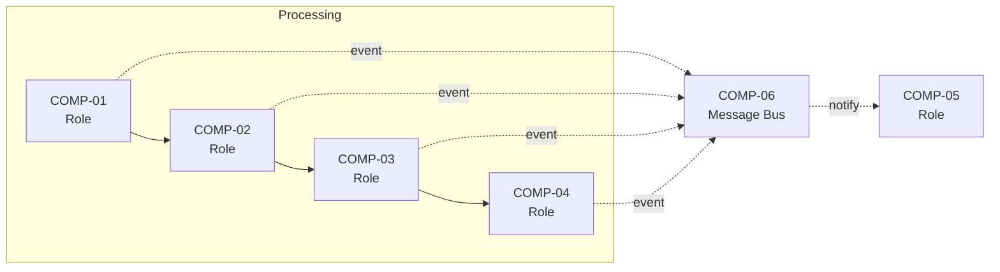
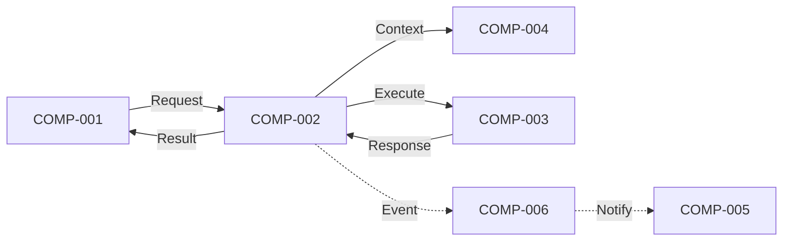

# [Project Name] - Integration Architecture Overview

> **Document Version**: 1.0
> **Last Updated**: YYYY-MM-DD
> **Status**: Draft | In Review | Approved
> **Owner**: [Name]
> **Related Documents**:
>
> - [Architecture Document](../architecture.md)
> - [Component Requirements](../requirements/)

---

## 1. Introduction

### 1.1 Purpose

This document provides the integration architecture for [Project Name], defining how components communicate, what data flows between them, and the contracts that govern their interactions.

### 1.2 Scope

This document covers:

- Component dependency relationships
- Communication patterns (sync vs async)
- Data flow overview
- Cross-references to detailed interface contracts, schemas, and messages

Detailed specifications are in:

- `contracts/` - Per-component interface contracts
- `schemas/` - Shared data structure definitions
- `messages/` - Message and event catalog

### 1.3 How to Read This Document

Start here for the big picture, then dive into specific contracts and schemas as needed.

---

## 2. Component Dependency Matrix

<!--
PURPOSE: Show which components depend on which others at a glance.
This matrix helps identify:
- Components with many dependencies (potential bottlenecks)
- Components with many dependents (high-impact if changed)
- Circular dependencies (architectural issues)

SYMBOLS:
→ = Synchronous call (caller waits for response)
⚡ = Asynchronous event (fire and forget / pub-sub)
📦 = Shared data dependency (both access same data store)
-->

|              | COMP-001 | COMP-002 | COMP-003 | COMP-004 | COMP-005 | COMP-006 |
| ------------ | -------- | -------- | -------- | -------- | -------- | -------- |
| **COMP-001** | -        | →        |          |          | →        | ⚡       |
| **COMP-002** |          | -        | →        | →        |          | ⚡       |
| **COMP-003** |          |          | -        |          |          | ⚡       |
| **COMP-004** |          |          |          | -        | →        |          |
| **COMP-005** |          |          |          |          | -        | ⚡       |
| **COMP-006** |          |          |          |          |          | -        |

**Legend**:

- → Synchronous call
- ⚡ Asynchronous event
- 📦 Shared data access
- (blank) No direct dependency

### 2.1 Dependency Analysis

<!--
PURPOSE: Highlight architectural observations from the matrix.
-->

| Observation                | Components  | Implication                      |
| -------------------------- | ----------- | -------------------------------- |
| High outbound dependencies | [Component] | May become a bottleneck          |
| High inbound dependencies  | [Component] | Changes have wide impact         |
| No dependencies            | [Component] | May be missing integration       |
| Circular dependency        | [A → B → A] | Requires architectural attention |

---

## 3. Communication Patterns

<!--
PURPOSE: Document the communication patterns used between components.
-->

### 3.1 Pattern Overview

| Pattern                              | Usage                           | Components Using  |
| ------------------------------------ | ------------------------------- | ----------------- |
| **Synchronous Request-Response**     | Direct calls where caller waits | [List components] |
| **Asynchronous Pub-Sub**             | Events broadcast to subscribers | [List components] |
| **Request-Response via Message Bus** | Async but expects response      | [List components] |
| **Streaming**                        | Continuous data flow            | [List components] |

### 3.2 Synchronous Interfaces

<!--
PURPOSE: List all synchronous (blocking) interfaces between components.
-->

| Caller   | Callee   | Interface        | Purpose             |
| -------- | -------- | ---------------- | ------------------- |
| COMP-001 | COMP-002 | [Interface name] | [Brief description] |
| COMP-002 | COMP-003 | [Interface name] | [Brief description] |

**Details**: See individual interface contracts in `contracts/` folder.

### 3.3 Asynchronous Events

<!--
PURPOSE: List all events flowing through the system.
-->

| Event       | Publisher | Subscribers        | Purpose             |
| ----------- | --------- | ------------------ | ------------------- |
| [EventName] | COMP-001  | COMP-005, COMP-006 | [Brief description] |
| [EventName] | COMP-002  | COMP-005, COMP-006 | [Brief description] |

**Details**: See message catalog in `messages/catalog.md`.

---

## 4. Data Flow Diagrams

<!--
PURPOSE: Visual representation of how data flows through the system.
Create diagrams for major workflows/use cases.
-->

### 4.1 Primary Data Flow: [Workflow Name]

**Flow Steps**:

1. [Step description]
2. [Step description]
3. [Step description]

---

### 4.2 Data Flow: [Another Workflow]

<!--
Add additional data flow diagrams as needed for other major workflows.
Use Mermaid for more complex diagrams:
-->

---

## 5. Shared Schema Summary

<!--
PURPOSE: List all shared data structures that cross component boundaries.
-->

| Schema       | Description         | Used By                      | Definition                                       |
| ------------ | ------------------- | ---------------------------- | ------------------------------------------------ |
| [SchemaName] | [Brief description] | COMP-001, COMP-002, COMP-004 | [schemas/schema-name.md](schemas/schema-name.md) |
| [SchemaName] | [Brief description] | COMP-002, COMP-003           | [schemas/schema-name.md](schemas/schema-name.md) |

### 5.1 Schema Ownership

<!--
PURPOSE: Clarify which component is the "owner" (source of truth) for each schema.
-->

| Schema       | Owner (Source of Truth) | Consumers          |
| ------------ | ----------------------- | ------------------ |
| [SchemaName] | COMP-001                | COMP-002, COMP-004 |
| [SchemaName] | COMP-003                | COMP-001, COMP-002 |

---

## 6. Interface Contract Index

<!--
PURPOSE: Quick reference to all interface contract documents.
-->

| Component | Contract Document                              | Interfaces Provided | Interfaces Required |
| --------- | ---------------------------------------------- | ------------------- | ------------------- |
| COMP-001  | [contracts/comp-001.md](contracts/comp-001.md) | 3                   | 2                   |
| COMP-002  | [contracts/comp-002.md](contracts/comp-002.md) | 5                   | 4                   |
| COMP-003  | [contracts/comp-003.md](contracts/comp-003.md) | 2                   | 1                   |

---

## 7. Cross-Cutting Integration Concerns

<!--
PURPOSE: Document integration patterns that apply across all components.
-->

### 7.1 Error Propagation

| Error Type            | Propagation Strategy             | Components Affected |
| --------------------- | -------------------------------- | ------------------- |
| Validation errors     | Return immediately, no retry     | All                 |
| Transient failures    | Retry with backoff at caller     | [List]              |
| Component unavailable | Emit error event, fail operation | [List]              |

### 7.2 Correlation and Tracing

| Concern             | Strategy                                     |
| ------------------- | -------------------------------------------- |
| Request correlation | [How requests are tracked across components] |
| Trace propagation   | [How trace IDs flow through the system]      |
| Log correlation     | [How logs are correlated]                    |

### 7.3 Security Boundaries

| Boundary        | From     | To           | Security Measure       |
| --------------- | -------- | ------------ | ---------------------- |
| [Boundary name] | COMP-001 | External API | [e.g., API key, OAuth] |

---

## 8. Integration Constraints

<!--
PURPOSE: Document constraints that affect how components integrate.
-->

| Constraint               | Source               | Impact                       |
| ------------------------ | -------------------- | ---------------------------- |
| [Constraint description] | [NFR-xxx or ADR-xxx] | [How it affects integration] |

---

## 9. Open Integration Questions

| Question ID | Question               | Owner  | Status          |
| ----------- | ---------------------- | ------ | --------------- |
| IQ-001      | [Integration question] | [Name] | Open / Resolved |

---

## 10. Traceability

### 10.1 FR to Interface Mapping

<!--
PURPOSE: Show which FRs are satisfied by which interfaces.
-->

| Functional Requirement | Interface(s)                             | Schema(s) |
| ---------------------- | ---------------------------------------- | --------- |
| FR-XX-001              | COMP-001.operation1, COMP-002.operation2 | Schema1   |
| FR-XX-002              | COMP-002.operation3                      | Schema2   |

### 10.2 Coverage Check

| Component | Total FRs | FRs with Interface Coverage | Coverage % |
| --------- | --------- | --------------------------- | ---------- |
| COMP-001  | XX        | XX                          | XX%        |
| COMP-002  | XX        | XX                          | XX%        |

---

## Document History

| Version | Date       | Author | Changes         |
| ------- | ---------- | ------ | --------------- |
| 1.0     | YYYY-MM-DD | [Name] | Initial version |
