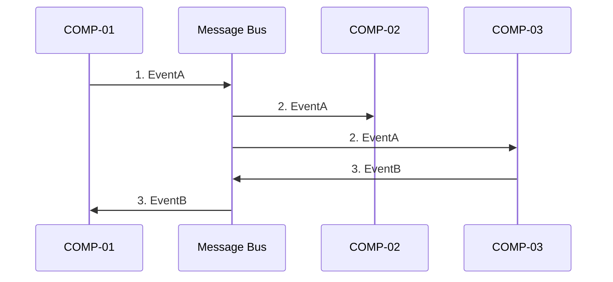

# [Project Name] - Message Catalog

> **Document Version**: 1.0
> **Last Updated**: YYYY-MM-DD
> **Status**: Draft | In Review | Approved
> **Owner**: [Name]
> **Related Documents**:
>
> - [Integration Overview](overview.md)

---

## 1. Introduction

### 1.1 Purpose

This document catalogs all messages (events, commands, queries) that flow through the system's message infrastructure. It serves as the single source of truth for asynchronous communication between components.

### 1.2 Message Types

| Type        | Description                          | Pattern           |
| ----------- | ------------------------------------ | ----------------- |
| **Event**   | Something that happened (past tense) | Publish-Subscribe |
| **Command** | Request to do something (imperative) | Point-to-Point    |
| **Query**   | Request for information              | Request-Response  |

### 1.3 Message ID Convention

Messages follow the format: **MSG-[TYPE]-XXX**

| Type    | Prefix  | Example     |
| ------- | ------- | ----------- |
| Event   | MSG-EVT | MSG-EVT-001 |
| Command | MSG-CMD | MSG-CMD-001 |
| Query   | MSG-QRY | MSG-QRY-001 |

---

## 2. Message Infrastructure

<!--
PURPOSE: Describe the messaging infrastructure context.
-->

### 2.1 Message Bus/Broker

| Attribute              | Value                                         |
| ---------------------- | --------------------------------------------- |
| **Component**          | [e.g., Message Manager (COMP-XXX)]            |
| **Pattern**            | [Pub-Sub / Message Queue / Event Bus]         |
| **Delivery Guarantee** | [At-most-once / At-least-once / Exactly-once] |

### 2.2 Common Message Envelope

<!--
PURPOSE: Define the wrapper structure for all messages.
-->

All messages are wrapped in a standard envelope:

| Field           | Type     | Required | Description                         |
| --------------- | -------- | -------- | ----------------------------------- |
| `messageId`     | string   | Yes      | Unique message identifier (UUID)    |
| `messageType`   | string   | Yes      | Message type identifier             |
| `timestamp`     | datetime | Yes      | When message was created (ISO 8601) |
| `correlationId` | string   | No       | For request-response correlation    |
| `traceId`       | string   | No       | For distributed tracing             |
| `source`        | string   | Yes      | Publishing component ID             |
| `payload`       | object   | Yes      | Message-specific data               |

**Example Envelope**:

```json
{
  "messageId": "550e8400-e29b-41d4-a716-446655440000",
  "messageType": "WORKFLOW_STARTED",
  "timestamp": "2025-01-15T10:30:00Z",
  "correlationId": "abc-123",
  "traceId": "trace-xyz",
  "source": "COMP-001",
  "payload": { ... }
}
```

---

## 3. Events

<!--
PURPOSE: Document all events in the system.
Events represent things that have happened (past tense).
-->

### 3.1 Event Summary

| Event ID    | Event Name  | Publisher | Subscribers        |
| ----------- | ----------- | --------- | ------------------ |
| MSG-EVT-001 | [EventName] | COMP-XXX  | COMP-XXX, COMP-XXX |
| MSG-EVT-002 | [EventName] | COMP-XXX  | COMP-XXX           |

---

### MSG-EVT-001: [EventName]

| Attribute       | Value                                  |
| --------------- | -------------------------------------- |
| **Event ID**    | MSG-EVT-001                            |
| **Event Name**  | [EventName] (e.g., `WORKFLOW_STARTED`) |
| **Publisher**   | COMP-XXX ([Component Name])            |
| **Subscribers** | COMP-XXX, COMP-XXX                     |
| **Implements**  | FR-XX-XXX                              |

**Description**: [What this event represents]

**When Published**: [Trigger condition - what causes this event]

**Payload Schema**:

| Field          | Type   | Required | Description   |
| -------------- | ------ | -------- | ------------- |
| `fieldName`    | string | Yes      | [Description] |
| `fieldName`    | number | No       | [Description] |
| `nestedObject` | object | No       | See below     |

**Nested Object: nestedObject**

| Field      | Type   | Required | Description   |
| ---------- | ------ | -------- | ------------- |
| `subField` | string | Yes      | [Description] |

**Delivery Requirements**:

| Attribute              | Value                                     |
| ---------------------- | ----------------------------------------- |
| **Ordering**           | [Per-entity / Global / None]              |
| **Delivery Guarantee** | [At-least-once / At-most-once]            |
| **Retention**          | [How long to retain undelivered messages] |

**Subscriber Expectations**:

| Subscriber | Expected Action                        |
| ---------- | -------------------------------------- |
| COMP-XXX   | [What subscriber does with this event] |
| COMP-XXX   | [What subscriber does with this event] |

**Example Payload**:

```json
{
  "fieldName": "example",
  "fieldName": 42,
  "nestedObject": {
    "subField": "value"
  }
}
```

---

### MSG-EVT-002: [EventName]

| Attribute       | Value       |
| --------------- | ----------- |
| **Event ID**    | MSG-EVT-002 |
| **Event Name**  | [EventName] |
| **Publisher**   | COMP-XXX    |
| **Subscribers** | COMP-XXX    |
| **Implements**  | FR-XX-XXX   |

[Continue pattern for each event...]

---

## 4. Commands

<!--
PURPOSE: Document all commands in the system.
Commands are requests for action (imperative).
-->

### 4.1 Command Summary

| Command ID  | Command Name  | Sender   | Handler  |
| ----------- | ------------- | -------- | -------- |
| MSG-CMD-001 | [CommandName] | COMP-XXX | COMP-XXX |

---

### MSG-CMD-001: [CommandName]

| Attribute        | Value         |
| ---------------- | ------------- |
| **Command ID**   | MSG-CMD-001   |
| **Command Name** | [CommandName] |
| **Sender**       | COMP-XXX      |
| **Handler**      | COMP-XXX      |
| **Implements**   | FR-XX-XXX     |

**Description**: [What this command requests]

**When Sent**: [Trigger condition]

**Payload Schema**:

| Field       | Type   | Required | Description   |
| ----------- | ------ | -------- | ------------- |
| `fieldName` | string | Yes      | [Description] |

**Expected Response**: [Description of expected response or acknowledgment]

**Error Responses**:

| Error Code   | Condition          | Sender Action           |
| ------------ | ------------------ | ----------------------- |
| `ERROR_CODE` | [When this occurs] | [What sender should do] |

**Example**:

```json
{
  "fieldName": "value"
}
```

---

## 5. Queries (Request-Response Messages)

<!--
PURPOSE: Document query messages that expect responses.
-->

### 5.1 Query Summary

| Query ID    | Query Name  | Requester | Responder |
| ----------- | ----------- | --------- | --------- |
| MSG-QRY-001 | [QueryName] | COMP-XXX  | COMP-XXX  |

---

### MSG-QRY-001: [QueryName]

| Attribute      | Value       |
| -------------- | ----------- |
| **Query ID**   | MSG-QRY-001 |
| **Query Name** | [QueryName] |
| **Requester**  | COMP-XXX    |
| **Responder**  | COMP-XXX    |
| **Implements** | FR-XX-XXX   |

**Description**: [What information is being requested]

**Request Payload**:

| Field       | Type   | Required | Description   |
| ----------- | ------ | -------- | ------------- |
| `fieldName` | string | Yes      | [Description] |

**Response Payload**:

| Field       | Type   | Description   |
| ----------- | ------ | ------------- |
| `fieldName` | string | [Description] |
| `fieldName` | array  | [Description] |

**Timeout**: [Expected response time, e.g., "5 seconds"]

**Example Request**:

```json
{
  "fieldName": "query-value"
}
```

**Example Response**:

```json
{
  "fieldName": "result",
  "fieldName": ["item1", "item2"]
}
```

---

## 6. Message Flows

<!--
PURPOSE: Show how messages flow through the system for key scenarios.
-->

### 6.1 Flow: [Scenario Name]

**Trigger**: [What initiates this flow]



**Steps**:

1. COMP-01 publishes EventA when [trigger]
2. COMP-02 and COMP-03 receive EventA and [action]
3. COMP-03 publishes EventB when [trigger]

---

## 7. Error Events

<!--
PURPOSE: Document error-related events.
-->

### 7.1 Standard Error Event Schema

All error events follow this schema:

| Field                  | Type   | Required | Description                    |
| ---------------------- | ------ | -------- | ------------------------------ |
| `errorCode`            | string | Yes      | Error code                     |
| `errorMessage`         | string | Yes      | Human-readable message         |
| `originatingComponent` | string | Yes      | Component where error occurred |
| `originalMessageId`    | string | No       | Message that caused the error  |
| `stackTrace`           | string | No       | For debugging (dev only)       |
| `context`              | object | No       | Additional context             |

### 7.2 Error Events

| Event               | When Published            | Severity |
| ------------------- | ------------------------- | -------- |
| `VALIDATION_ERROR`  | Input validation fails    | Warning  |
| `PROCESSING_ERROR`  | Processing logic fails    | Error    |
| `INTEGRATION_ERROR` | External dependency fails | Error    |

---

## 8. Message Versioning

### 8.1 Versioning Strategy

| Attribute                   | Value                                                     |
| --------------------------- | --------------------------------------------------------- |
| **Versioning Approach**     | [Schema version in message type / Envelope version field] |
| **Backwards Compatibility** | [How long old versions are supported]                     |

### 8.2 Evolution Rules

**Non-Breaking Changes**:

- Adding optional fields to payload
- Adding new message types

**Breaking Changes** (require version bump):

- Removing fields
- Changing field types
- Changing message type names

---

## 9. Traceability

### 9.1 FR to Message Mapping

| Functional Requirement | Messages                 |
| ---------------------- | ------------------------ |
| FR-XX-001              | MSG-EVT-001, MSG-CMD-001 |
| FR-XX-002              | MSG-EVT-002              |

### 9.2 Component to Message Mapping

| Component | Publishes                | Subscribes To            |
| --------- | ------------------------ | ------------------------ |
| COMP-XXX  | MSG-EVT-001, MSG-EVT-002 | MSG-EVT-003              |
| COMP-XXX  | MSG-CMD-001              | MSG-EVT-001, MSG-EVT-002 |

---

## 10. Message Index

| ID          | Name   | Type    | Publisher | Subscribers/Handler |
| ----------- | ------ | ------- | --------- | ------------------- |
| MSG-EVT-001 | [Name] | Event   | COMP-XXX  | COMP-XXX, COMP-XXX  |
| MSG-EVT-002 | [Name] | Event   | COMP-XXX  | COMP-XXX            |
| MSG-CMD-001 | [Name] | Command | COMP-XXX  | COMP-XXX            |
| MSG-QRY-001 | [Name] | Query   | COMP-XXX  | COMP-XXX            |

---

## Document History

| Version | Date       | Author | Changes         |
| ------- | ---------- | ------ | --------------- |
| 1.0     | YYYY-MM-DD | [Name] | Initial version |
