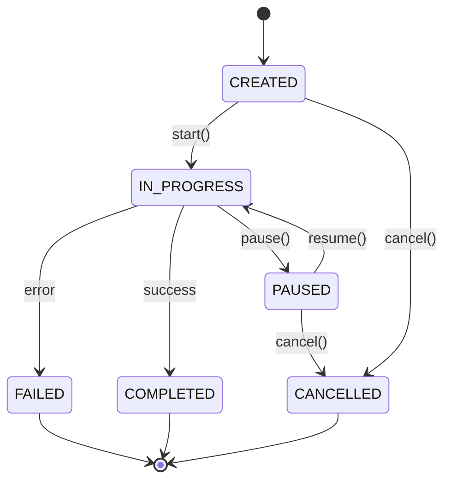

# [Schema Name] - Shared Schema Definition

> **Schema ID**: SCH-XXX
> **Document Version**: 1.0
> **Last Updated**: YYYY-MM-DD
> **Status**: Draft | In Review | Approved
> **Owner**: [Name]
> **Related Documents**:
>
> - [Integration Overview](../overview.md)

---

## 1. Overview

### 1.1 Purpose

This document defines the **[Schema Name]** schema, a shared data structure used across multiple components.

### 1.2 Schema Summary

| Attribute                   | Value                        |
| --------------------------- | ---------------------------- |
| **Schema ID**               | SCH-XXX                      |
| **Schema Name**             | [Name]                       |
| **Owner (Source of Truth)** | COMP-XXX                     |
| **Consumers**               | COMP-XXX, COMP-XXX, COMP-XXX |

### 1.3 Why This Is Shared

<!--
PURPOSE: Explain why this schema is shared rather than component-specific.
-->

[Explanation of why multiple components need the same data structure, e.g., "This schema represents task state which is created by Orchestrator, read by Context Manager, and persisted by State Manager. Inconsistent definitions would cause integration failures."]

---

## 2. Schema Definition

### 2.1 Field Definitions

| Field       | Type     | Required | Constraints | Description           |
| ----------- | -------- | -------- | ----------- | --------------------- |
| `id`        | string   | Yes      | UUID format | Unique identifier     |
| `name`      | string   | Yes      | 1-100 chars | Display name          |
| `status`    | enum     | Yes      | See 2.2     | Current status        |
| `createdAt` | datetime | Yes      | ISO 8601    | Creation timestamp    |
| `updatedAt` | datetime | Yes      | ISO 8601    | Last update timestamp |
| `metadata`  | object   | No       | See 2.3     | Optional metadata     |

### 2.2 Enum Definitions

#### Status Enum

| Value         | Description           | Transitions To                  |
| ------------- | --------------------- | ------------------------------- |
| `CREATED`     | Initial state         | `IN_PROGRESS`, `CANCELLED`      |
| `IN_PROGRESS` | Currently executing   | `COMPLETED`, `FAILED`, `PAUSED` |
| `PAUSED`      | Temporarily stopped   | `IN_PROGRESS`, `CANCELLED`      |
| `COMPLETED`   | Successfully finished | (terminal)                      |
| `FAILED`      | Finished with error   | (terminal)                      |
| `CANCELLED`   | User cancelled        | (terminal)                      |

### 2.3 Nested Object Definitions

#### Metadata Object

| Field   | Type   | Required | Description    |
| ------- | ------ | -------- | -------------- |
| `key`   | string | Yes      | Metadata key   |
| `value` | any    | Yes      | Metadata value |

---

## 3. Validation Rules

<!--
PURPOSE: Define business rules that validate instances of this schema.
-->

### 3.1 Field-Level Validation

| Field       | Rule                             | Error Code            |
| ----------- | -------------------------------- | --------------------- |
| `id`        | Must be valid UUID v4            | `INVALID_ID_FORMAT`   |
| `name`      | Must not be empty, max 100 chars | `INVALID_NAME`        |
| `createdAt` | Must be valid ISO 8601 datetime  | `INVALID_DATETIME`    |
| `updatedAt` | Must be >= createdAt             | `INVALID_UPDATE_TIME` |

### 3.2 Cross-Field Validation

| Rule               | Fields Involved    | Error Code   |
| ------------------ | ------------------ | ------------ |
| [Rule description] | `field1`, `field2` | `ERROR_CODE` |

### 3.3 Business Rules

| Rule        | Description              | Error Code   |
| ----------- | ------------------------ | ------------ |
| [Rule name] | [When this rule applies] | `ERROR_CODE` |

---

## 4. Format Specifications

<!--
PURPOSE: Explicitly define formats to prevent inconsistencies.
-->

| Data Type | Format                 | Example                                |
| --------- | ---------------------- | -------------------------------------- |
| Datetime  | ISO 8601 with timezone | `2025-01-15T10:30:00Z`                 |
| UUID      | UUID v4 lowercase      | `550e8400-e29b-41d4-a716-446655440000` |
| Duration  | ISO 8601 duration      | `PT1H30M` (1 hour 30 minutes)          |

---

## 5. Usage by Components

<!--
PURPOSE: Document how each component uses this schema.
-->

### 5.1 Component Usage Matrix

| Component | Creates | Reads | Updates | Deletes |
| --------- | ------- | ----- | ------- | ------- |
| COMP-XXX  | ✓       | ✓     | ✓       | ✓       |
| COMP-XXX  |         | ✓     |         |         |
| COMP-XXX  |         | ✓     | ✓       |         |

### 5.2 Per-Component Usage Details

#### COMP-XXX ([Component Name])

**Role**: [Owner / Consumer]

**Operations**:

- Creates instances when [trigger]
- Updates [fields] when [trigger]
- Reads for [purpose]

**Fields Used**: `id`, `name`, `status` (all fields / subset)

---

#### COMP-XXX ([Component Name])

**Role**: Consumer

**Operations**:

- Reads instances for [purpose]

**Fields Used**: `id`, `name` (subset only)

---

## 6. Lifecycle

<!--
PURPOSE: Document how instances of this schema are created, modified, and deleted.
-->

### 6.1 State Diagram



### 6.2 Lifecycle Events

| Transition              | Trigger               | Side Effects                    |
| ----------------------- | --------------------- | ------------------------------- |
| CREATED → IN_PROGRESS   | `start()` called      | [Events emitted, state changes] |
| IN_PROGRESS → COMPLETED | Successful completion | [Events emitted, cleanup]       |
| IN_PROGRESS → FAILED    | Error occurred        | [Error logged, cleanup]         |

---

## 7. Versioning

### 7.1 Schema Version

| Attribute                      | Value |
| ------------------------------ | ----- |
| **Current Version**            | 1.0   |
| **Backwards Compatible Since** | 1.0   |

### 7.2 Evolution Rules

<!--
PURPOSE: Define how this schema can change without breaking consumers.
-->

**Allowed Changes (Non-Breaking)**:

- Adding optional fields
- Adding new enum values (if consumers handle unknown values)
- Relaxing constraints (e.g., increasing max length)

**Breaking Changes (Require Version Bump)**:

- Removing fields
- Changing field types
- Adding required fields
- Tightening constraints

### 7.3 Change History

| Version | Date       | Changes         | Migration |
| ------- | ---------- | --------------- | --------- |
| 1.0     | YYYY-MM-DD | Initial version | N/A       |

---

## 8. Examples

### 8.1 Minimal Valid Instance

```json
{
  "id": "550e8400-e29b-41d4-a716-446655440000",
  "name": "Example",
  "status": "CREATED",
  "createdAt": "2025-01-15T10:30:00Z",
  "updatedAt": "2025-01-15T10:30:00Z"
}
```

### 8.2 Complete Instance (All Fields)

```json
{
  "id": "550e8400-e29b-41d4-a716-446655440000",
  "name": "Complete Example",
  "status": "IN_PROGRESS",
  "createdAt": "2025-01-15T10:30:00Z",
  "updatedAt": "2025-01-15T11:45:00Z",
  "metadata": {
    "key": "customField",
    "value": "customValue"
  }
}
```

### 8.3 Edge Cases

| Case                | Example                   | Notes                     |
| ------------------- | ------------------------- | ------------------------- |
| Minimum name length | `{"name": "A"}`           | Single character is valid |
| Maximum name length | `{"name": "[100 chars]"}` | 100 characters exactly    |
| Empty metadata      | `{"metadata": {}}`        | Valid but empty           |

---

## 9. Related Schemas

<!--
PURPOSE: Show relationships to other schemas.
-->

| Related Schema | Relationship | Description                   |
| -------------- | ------------ | ----------------------------- |
| [SchemaName]   | Has many     | [Description of relationship] |
| [SchemaName]   | Belongs to   | [Description of relationship] |

---

## 10. Traceability

### 10.1 Requirement Coverage

| Requirement | How This Schema Supports      |
| ----------- | ----------------------------- |
| FR-XX-XXX   | [How schema supports this FR] |

---

## Document History

| Version | Date       | Author | Changes         |
| ------- | ---------- | ------ | --------------- |
| 1.0     | YYYY-MM-DD | [Name] | Initial version |
