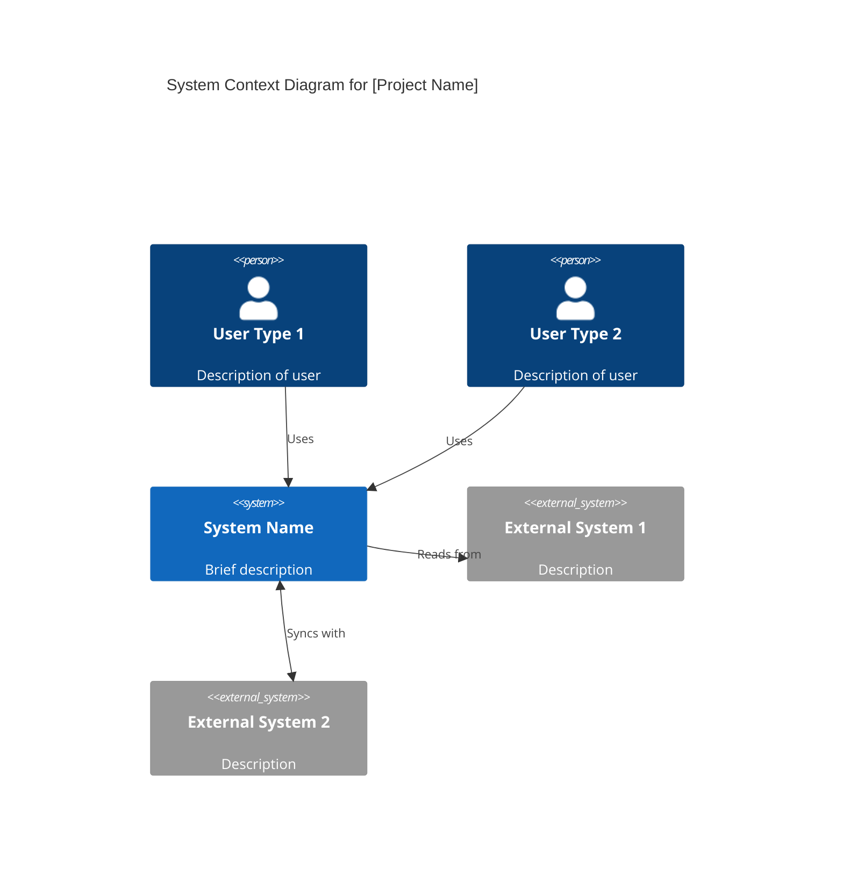

# [Project Name] - System Architecture

> **Document Version**: 1.0
> **Last Updated**: YYYY-MM-DD
> **Status**: Draft | In Review | Approved
> **Owner**: [Name]
> **Related Documents**:
>
> - [Overview Document](link)
> - [Requirements Document](link)

---

## 1. Introduction

### 1.1 Purpose

This document describes the high-level architecture of [Project Name], defining
the major components, their responsibilities, and how they interact. It provides
the foundation for detailed design work in Stage 4.

### 1.2 Scope

This architecture document covers:

- System context and boundaries
- Major components and their responsibilities
- Component interactions and interfaces
- Cross-cutting concerns (logging, security, error handling)
- Key architectural decisions and their rationale

### 1.3 Architecture Decision Records

Significant architectural decisions are documented in separate ADR files:

- [ADR-001: Database Selection](decisions/001-database-selection.md)
- [ADR-002: API Framework](decisions/002-api-framework.md)
- [Add more as needed...]

---

## 2. Architectural Drivers

<!--
PURPOSE: Summarize the key requirements that drive architectural decisions.
These are pulled from the Requirements document.
-->

### 2.1 Key Functional Requirements

| Requirement ID | Summary         | Architectural Impact            |
| -------------- | --------------- | ------------------------------- |
| FR-XXX         | [Brief summary] | [How this affects architecture] |
| FR-XXX         | [Brief summary] | [How this affects architecture] |

### 2.2 Key Quality Attributes

| NFR ID  | Quality Attribute | Target   | Architectural Impact            |
| ------- | ----------------- | -------- | ------------------------------- |
| NFR-XXX | Performance       | [Target] | [How this affects architecture] |
| NFR-XXX | Scalability       | [Target] | [How this affects architecture] |
| NFR-XXX | Availability      | [Target] | [How this affects architecture] |
| NFR-XXX | Security          | [Target] | [How this affects architecture] |

### 2.3 Constraints

| Constraint   | Source                  | Architectural Impact            |
| ------------ | ----------------------- | ------------------------------- |
| [Constraint] | [Overview/Requirements] | [How this affects architecture] |

---

## 3. System Context

<!--
PURPOSE: Show the system as a black box within its environment.
This is the C4 "Context" level diagram.
-->

### 3.1 Context Diagram

```
┌─────────────────────────────────────────────────────────────────────────────┐
│                              ENVIRONMENT                                      │
│                                                                               │
│    ┌──────────┐          ┌─────────────────────────┐         ┌──────────┐   │
│    │  User    │─────────▶│                         │◀────────│ External │   │
│    │  Type 1  │          │                         │         │ System 1 │   │
│    └──────────┘          │     [SYSTEM NAME]       │         └──────────┘   │
│                          │                         │                         │
│    ┌──────────┐          │    [Brief description   │         ┌──────────┐   │
│    │  User    │─────────▶│     of the system]      │◀───────▶│ External │   │
│    │  Type 2  │          │                         │         │ System 2 │   │
│    └──────────┘          └─────────────────────────┘         └──────────┘   │
│                                                                               │
└─────────────────────────────────────────────────────────────────────────────┘
```

[Or include a Mermaid diagram:]



### 3.2 External Actors

| Actor        | Type          | Description   | Interaction         |
| ------------ | ------------- | ------------- | ------------------- |
| [Actor name] | User / System | [Description] | [How they interact] |

---

## 4. Solution Strategy

<!--
PURPOSE: Describe the high-level approach to solving the architectural
challenges. This sets the stage for component decomposition.
-->

### 4.1 Architectural Style

**Primary Architecture Pattern**: [e.g., Microservices / Modular Monolith / Layered / Event-Driven]

**Rationale**: [Why this pattern was chosen - reference ADR if applicable]

### 4.2 Key Technology Decisions

| Decision Area        | Choice              | Rationale | ADR       |
| -------------------- | ------------------- | --------- | --------- |
| Programming Language | [Language]          | [Why]     | [ADR-XXX] |
| Database             | [Database]          | [Why]     | [ADR-XXX] |
| API Style            | [REST/GraphQL/gRPC] | [Why]     | [ADR-XXX] |
| Messaging            | [If applicable]     | [Why]     | [ADR-XXX] |

### 4.3 Architectural Principles

<!--
PURPOSE: Document the guiding principles that inform architectural decisions.
-->

1. **[Principle 1]**: [Description and rationale]
2. **[Principle 2]**: [Description and rationale]
3. **[Principle 3]**: [Description and rationale]

---

## 5. Component Architecture

<!--
PURPOSE: Define the major components of the system.
This is the C4 "Container" level for the overall system.
-->

### 5.1 Component Overview Diagram

```
┌─────────────────────────────────────────────────────────────────────┐
│                         SYSTEM BOUNDARY                              │
│                                                                      │
│  ┌─────────────┐    ┌─────────────┐    ┌─────────────┐             │
│  │   COMP-001  │    │   COMP-002  │    │   COMP-003  │             │
│  │  [Name]     │───▶│  [Name]     │───▶│  [Name]     │             │
│  │             │    │             │    │             │             │
│  │ [Purpose]   │    │ [Purpose]   │    │ [Purpose]   │             │
│  └─────────────┘    └─────────────┘    └─────────────┘             │
│         │                  │                  │                     │
│         │                  ▼                  │                     │
│         │          ┌─────────────┐            │                     │
│         │          │   COMP-004  │            │                     │
│         └─────────▶│  [Name]     │◀───────────┘                     │
│                    │             │                                   │
│                    │ [Purpose]   │                                   │
│                    └─────────────┘                                   │
│                           │                                          │
│                           ▼                                          │
│                    ┌─────────────┐                                   │
│                    │  Database   │                                   │
│                    └─────────────┘                                   │
└─────────────────────────────────────────────────────────────────────┘
```

[Or use Mermaid for the diagram]

### 5.2 Component Catalog

#### COMP-001: [Component Name]

| Attribute      | Value                                    |
| -------------- | ---------------------------------------- |
| **ID**         | COMP-001                                 |
| **Name**       | [Component Name]                         |
| **Type**       | Service / Library / Database / UI / etc. |
| **Technology** | [Primary technology/framework]           |

**Responsibility**:
[Clear description of what this component is responsible for]

**NOT Responsible For**:
[What this component does NOT handle - clarifies boundaries]

**Implements Requirements**:

- FR-XXX: [Requirement title]
- FR-XXX: [Requirement title]

**Dependencies**:
| Depends On | Purpose |
|------------|---------|
| [Component] | [Why it needs this dependency] |

**Interface Summary**:
[High-level description of how other components interact with this one]

---

#### COMP-002: [Component Name]

| Attribute      | Value                                    |
| -------------- | ---------------------------------------- |
| **ID**         | COMP-002                                 |
| **Name**       | [Component Name]                         |
| **Type**       | Service / Library / Database / UI / etc. |
| **Technology** | [Primary technology/framework]           |

**Responsibility**:
[Clear description of what this component is responsible for]

**NOT Responsible For**:
[What this component does NOT handle]

**Implements Requirements**:

- FR-XXX: [Requirement title]
- NFR-XXX: [Requirement title]

**Dependencies**:
| Depends On | Purpose |
|------------|---------|
| [Component] | [Why it needs this dependency] |

**Interface Summary**:
[High-level description of how other components interact with this one]

---

[Continue for all components...]

---

## 6. Component Interactions

<!--
PURPOSE: Describe how components communicate with each other.
-->

### 6.1 Communication Patterns

| From     | To       | Pattern      | Protocol      | Purpose   |
| -------- | -------- | ------------ | ------------- | --------- |
| COMP-001 | COMP-002 | Synchronous  | REST/HTTP     | [Purpose] |
| COMP-002 | COMP-003 | Asynchronous | Message Queue | [Purpose] |

### 6.2 Key Interaction Flows

#### Flow 1: [Flow Name]

**Trigger**: [What initiates this flow]
**Purpose**: [What this flow accomplishes]

```
┌─────────┐     ┌─────────┐     ┌─────────┐     ┌─────────┐
│  User   │     │ COMP-01 │     │ COMP-02 │     │ COMP-03 │
└────┬────┘     └────┬────┘     └────┬────┘     └────┬────┘
     │               │               │               │
     │  1. Request   │               │               │
     │──────────────▶│               │               │
     │               │  2. Process   │               │
     │               │──────────────▶│               │
     │               │               │  3. Store     │
     │               │               │──────────────▶│
     │               │               │               │
     │               │               │  4. Confirm   │
     │               │               │◀──────────────│
     │               │  5. Response  │               │
     │               │◀──────────────│               │
     │  6. Result    │               │               │
     │◀──────────────│               │               │
     │               │               │               │
```

**Steps**:

1. [Description of step 1]
2. [Description of step 2]
3. [Description of step 3]
   ...

---

#### Flow 2: [Flow Name]

[Continue pattern for other key flows...]

---

## 7. Cross-Cutting Concerns

<!--
PURPOSE: Document how cross-cutting concerns are handled consistently
across all components. These strategies apply system-wide.
-->

### 7.1 Logging Strategy

**Approach**: [Centralized logging / Distributed logging / etc.]

| Aspect      | Standard                                    |
| ----------- | ------------------------------------------- |
| Log Format  | [e.g., JSON structured logs]                |
| Log Levels  | DEBUG, INFO, WARN, ERROR, FATAL             |
| Correlation | [How requests are traced across components] |
| Storage     | [Where logs are stored]                     |
| Retention   | [How long logs are kept]                    |

**Logging Standards**:

- All components shall log [what must be logged]
- Logs shall include [required fields: timestamp, level, correlation ID, etc.]
- PII shall [never be logged / be redacted / etc.]

---

### 7.2 Error Handling Strategy

**Approach**: [Description of error handling philosophy]

| Error Type               | Handling Strategy |
| ------------------------ | ----------------- |
| Validation errors        | [How handled]     |
| Business logic errors    | [How handled]     |
| Infrastructure errors    | [How handled]     |
| External system failures | [How handled]     |

**Error Response Format**:

```json
{
  "error": {
    "code": "ERROR_CODE",
    "message": "Human-readable message",
    "details": {}
  }
}
```

**Retry Strategy**:
| Condition | Retries | Backoff |
|-----------|---------|---------|
| [Condition] | [Count] | [Strategy: exponential, linear, etc.] |

---

### 7.3 Security Strategy

**Authentication**:
[How authentication is handled across the system]

**Authorization**:
[How authorization is enforced]

**Data Protection**:
| Layer | Protection |
|-------|-----------|
| Transit | [e.g., TLS 1.3] |
| Rest | [e.g., AES-256 encryption] |
| Application | [e.g., field-level encryption for PII] |

**Security Standards**:

- [Standard 1]
- [Standard 2]
- Reference: [ADR-XXX for security decisions]

---

### 7.4 Configuration Management

**Approach**: [How configuration is managed]

| Configuration Type   | Storage                            | Example             |
| -------------------- | ---------------------------------- | ------------------- |
| Secrets              | [e.g., Vault, AWS Secrets Manager] | API keys, passwords |
| Environment-specific | [e.g., Environment variables]      | URLs, feature flags |
| Static               | [e.g., Config files]               | Timeouts, limits    |

---

### 7.5 Monitoring & Observability

**Metrics**:
| Metric Category | Examples | Tool |
|-----------------|----------|------|
| Application | Request rate, latency, errors | [Tool] |
| Infrastructure | CPU, memory, disk | [Tool] |
| Business | [Domain-specific metrics] | [Tool] |

**Alerting**:
| Condition | Severity | Response |
|-----------|----------|----------|
| [Condition] | Critical/Warning/Info | [Expected action] |

**Tracing**:
[How distributed tracing is implemented across components]

---

## 8. Data Architecture

<!--
PURPOSE: High-level view of data storage and flow.
Detailed data models are in Stage 4.
-->

### 8.1 Data Storage Overview

| Data Store   | Type                   | Purpose               | Owner       |
| ------------ | ---------------------- | --------------------- | ----------- |
| [Store name] | [SQL/NoSQL/Cache/etc.] | [What data it stores] | [Component] |

### 8.2 Data Flow Overview

```
┌─────────┐     ┌─────────┐     ┌─────────┐
│  Input  │────▶│ Process │────▶│ Storage │
└─────────┘     └─────────┘     └─────────┘
     │               │               │
     │               │               ▼
     │               │         ┌─────────┐
     │               └────────▶│  Cache  │
     │                         └─────────┘
     │                               │
     ▼                               ▼
┌─────────┐                    ┌─────────┐
│  Audit  │                    │  Query  │
│   Log   │                    │ Service │
└─────────┘                    └─────────┘
```

### 8.3 Data Consistency Model

[Describe the consistency guarantees - eventual consistency, strong consistency, etc.]

---

## 9. Deployment Architecture

<!--
PURPOSE: Describe how the system is deployed.
-->

### 9.1 Deployment Diagram

```
┌─────────────────────────────────────────────────────────────────┐
│                        Production Environment                     │
│                                                                   │
│  ┌─────────────┐    ┌─────────────────────────────────────────┐ │
│  │    Load     │    │           Application Tier               │ │
│  │  Balancer   │───▶│  ┌─────┐  ┌─────┐  ┌─────┐             │ │
│  └─────────────┘    │  │ App │  │ App │  │ App │             │ │
│                     │  │  1  │  │  2  │  │  3  │             │ │
│                     │  └─────┘  └─────┘  └─────┘             │ │
│                     └─────────────────────────────────────────┘ │
│                                    │                             │
│                                    ▼                             │
│                     ┌─────────────────────────────────────────┐ │
│                     │              Data Tier                   │ │
│                     │  ┌──────────┐    ┌──────────┐           │ │
│                     │  │ Primary  │───▶│ Replica  │           │ │
│                     │  │    DB    │    │    DB    │           │ │
│                     │  └──────────┘    └──────────┘           │ │
│                     └─────────────────────────────────────────┘ │
└─────────────────────────────────────────────────────────────────┘
```

### 9.2 Environment Overview

| Environment | Purpose                | Characteristics   |
| ----------- | ---------------------- | ----------------- |
| Development | Individual development | [Characteristics] |
| Staging     | Pre-production testing | [Characteristics] |
| Production  | Live system            | [Characteristics] |

---

## 10. Architecture Decisions

<!--
PURPOSE: Reference the Architecture Decision Records.
Detailed ADRs are in separate files.
-->

| ADR                             | Title   | Status   | Summary            |
| ------------------------------- | ------- | -------- | ------------------ |
| [ADR-001](decisions/001-xxx.md) | [Title] | Accepted | [One-line summary] |
| [ADR-002](decisions/002-xxx.md) | [Title] | Accepted | [One-line summary] |

---

## 11. Open Questions & Risks

### 11.1 Open Questions

| Question ID | Question   | Owner  | Target Date |
| ----------- | ---------- | ------ | ----------- |
| AQ-001      | [Question] | [Name] | [Date]      |

### 11.2 Technical Risks

| Risk ID | Risk   | Likelihood   | Impact       | Mitigation |
| ------- | ------ | ------------ | ------------ | ---------- |
| TR-001  | [Risk] | Low/Med/High | Low/Med/High | [Strategy] |

---

## 12. Glossary

| Term   | Definition   |
| ------ | ------------ |
| [Term] | [Definition] |

---

## Document History

| Version | Date       | Author | Changes         |
| ------- | ---------- | ------ | --------------- |
| 1.0     | YYYY-MM-DD | [Name] | Initial version |
