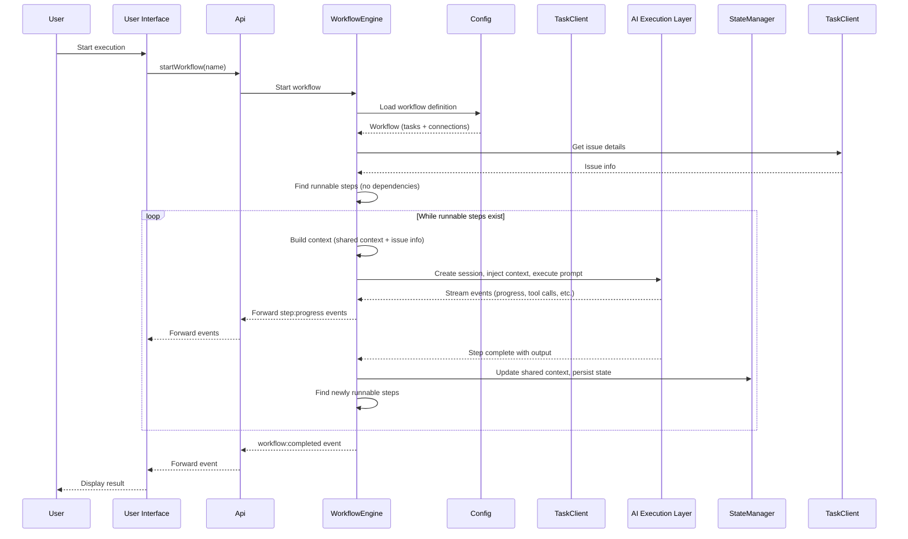
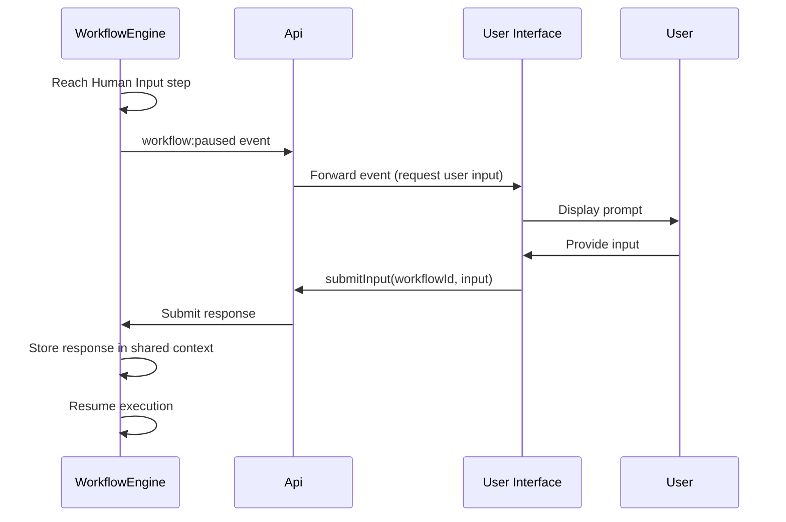
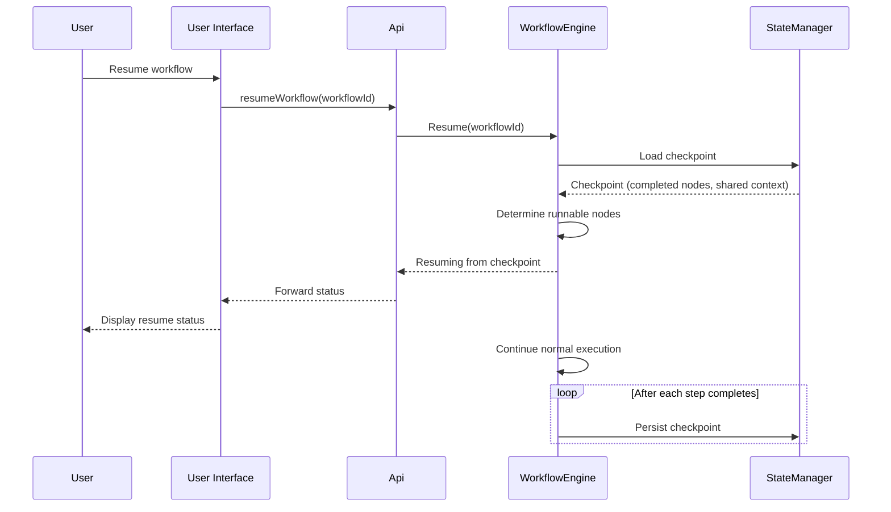
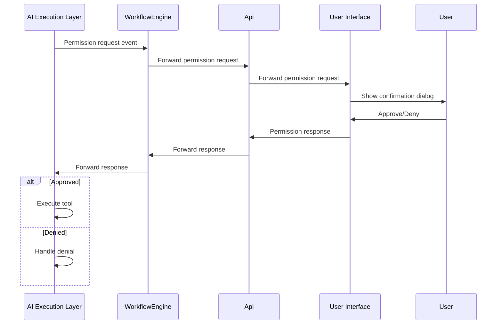
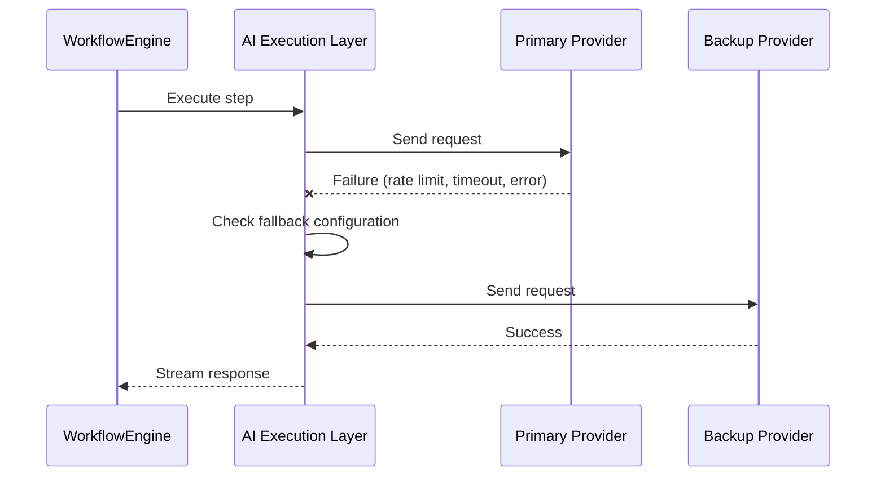
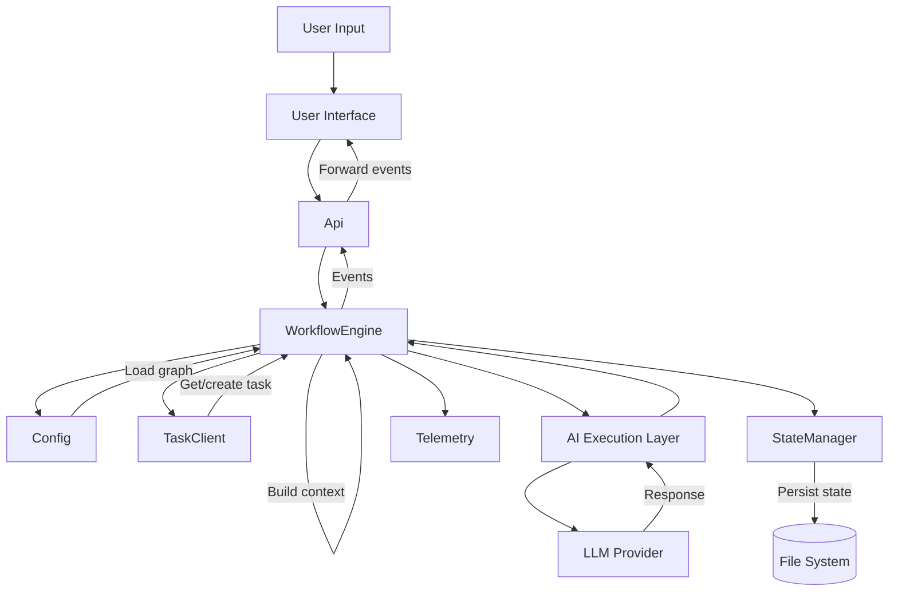

# FloMaster - System Architecture (DEPRECATED)

> ⚠️ **DEPRECATED**: This document has been superseded by [04-opencode-architecture.md](./04-opencode-architecture.md).
>
> This original architecture was designed for a standalone FloMaster application using the OpenCode SDK. The project has pivoted to forking OpenCode directly, making this document obsolete.
>
> **Do not use this document for new development.**

---

> **Document Version**: 1.0
> **Last Updated**: 2025-12-25
> **Status**: ~~Draft~~ **DEPRECATED**
> **Owner**: Architecture Team
> **Related Documents**:
>
> - [Product Overview](./01-product-overview.md)
> - [Requirements Overview](./02-requirements-overview.md)
> - **[NEW ARCHITECTURE](./04-opencode-architecture.md)** ← Use this instead

---

## 1. Introduction

### 1.1 Purpose

This document describes the high-level architecture of FloMaster, defining the
major components, their responsibilities, and how they interact. It provides the
foundation for detailed design work in Stage 4.

### 1.2 Scope

This architecture document covers:

- System context and boundaries
- Package structure and code organization
- Major components and their responsibilities
- Component interactions and interfaces
- Cross-cutting concerns (logging, security, error handling)

### 1.3 Component Reading Order

Components are organized by **dependency order** (foundational first, then those that build on them).

| Order | ID       | Component             | Main Class       | Why Here                                   |
| ----- | -------- | --------------------- | ---------------- | ------------------------------------------ |
| 1     | COMP-001 | Configuration Manager | `Config`         | Foundational - no dependencies             |
| 2     | COMP-002 | Task Manager          | `TaskClient`     | Depends on Config                          |
| 3     | COMP-003 | State Manager         | `StateManager`   | Depends on Config                          |
| 4     | COMP-004 | Telemetry             | `Telemetry`      | Depends on Config, StateManager            |
| 5     | COMP-005 | Orchestrator          | `WorkflowEngine` | Depends on all support layer components    |
| 6     | COMP-006 | API                   | `Api`            | Depends on WorkflowEngine + all components |
| 7     | COMP-007 | User Interface        | (Components)     | Depends on API                             |

---

## 2. Architectural Drivers

### 2.1 Key High-Level Requirements

Requirements are organized by architectural layer, showing how each drives component design.

#### Infrastructure Layer

| Requirement ID | Summary                              | Architectural Impact              |
| -------------- | ------------------------------------ | --------------------------------- |
| HL-EV-001      | Event streaming for UI updates       | WorkflowEngine emits events to UI |
| HL-CF-001      | Configuration defaults and overrides | Requires Config component         |
| HL-CF-002      | Configuration validation             | Schema validation in Config       |

#### Persistence Layer

| Requirement ID | Summary                    | Architectural Impact                          |
| -------------- | -------------------------- | --------------------------------------------- |
| HL-SR-001      | Workflow state persistence | StateManager manages workflow state           |
| HL-SR-002      | Crash recovery             | StateManager + AI execution layer checkpoints |
| HL-SR-003      | Artifact storage           | AI execution layer stores session artifacts   |

#### Observability Layer

| Requirement ID | Summary             | Architectural Impact              |
| -------------- | ------------------- | --------------------------------- |
| HL-OB-001      | Distributed tracing | Requires telemetry infrastructure |
| HL-OB-002      | Log aggregation     | Centralized log collection        |
| HL-OB-003      | Metrics collection  | Performance and usage metrics     |

#### Provider Layer

| Requirement ID | Summary                 | Architectural Impact                       |
| -------------- | ----------------------- | ------------------------------------------ |
| HL-PM-001      | Multi-provider support  | Handled by AI execution layer              |
| HL-PM-002      | Provider selection      | Config exposes, AI execution layer handles |
| HL-PM-003      | Provider fallback       | Handled by AI execution layer              |
| HL-AU-001      | Provider authentication | Config exposes, AI execution layer handles |

#### Context Layer

| Requirement ID | Summary                             | Architectural Impact                   |
| -------------- | ----------------------------------- | -------------------------------------- |
| HL-CM-001      | Context building                    | WorkflowEngine builds context per step |
| HL-CM-002      | Context persistence and loading     | StateManager manages shared context    |
| HL-CM-004      | Optional and required context items | WorkflowEngine validates context items |

#### Task Layer

| Requirement ID | Summary                 | Architectural Impact     |
| -------------- | ----------------------- | ------------------------ |
| HL-TM-001      | Unified task management | Requires tasks component |

#### Execution Layer

| Requirement ID | Summary                     | Architectural Impact                     |
| -------------- | --------------------------- | ---------------------------------------- |
| HL-CM-003      | Step execution via agents   | WorkflowEngine coordinates with AI layer |
| HL-VL-001      | Schema validation           | Validation utilities in WorkflowEngine   |
| HL-VL-002      | Output validation           | Structured output via AI execution layer |
| HL-VL-003      | Validation failure handling | Retry logic with error feedback          |
| HL-VL-004      | AI-powered validation       | Validation via separate AI session       |
| HL-VL-005      | Deterministic validation    | File existence, step success checks      |

#### Orchestration Layer

| Requirement ID | Summary                               | Architectural Impact               |
| -------------- | ------------------------------------- | ---------------------------------- |
| HL-WF-001      | Autonomous multi-step execution       | Requires WorkflowEngine            |
| HL-WF-003      | Dependency-based execution            | Dependency-based scheduling        |
| HL-WF-004      | Step dependencies and context passing | Data flow between steps            |
| HL-WF-005      | Conditional execution                 | Branch based on runtime conditions |

#### Presentation Layer

| Requirement ID | Summary               | Architectural Impact                   |
| -------------- | --------------------- | -------------------------------------- |
| HL-UI-001      | CLI interface         | Requires cli package                   |
| HL-UI-002      | Desktop UI interface  | Requires desktop package               |
| HL-API-001     | Unified API surface   | Single entry point for all UI requests |
| HL-API-002     | Request routing       | Api routes to appropriate components   |
| HL-API-003     | Event streaming to UI | Api forwards WorkflowEngine events     |
| HL-API-004     | Request validation    | Validate requests before routing       |
| HL-API-005     | Stateless operation   | No session state in API layer          |
| HL-API-006     | Transport abstraction | IPC for Electron, in-process for CLI   |

### 2.2 Key Quality Attributes

| NFR ID       | Quality Attribute | Target                   | Architectural Impact                            |
| ------------ | ----------------- | ------------------------ | ----------------------------------------------- |
| NFR-PERF-001 | Response Time     | < 500ms for CLI commands | Async processing, streaming responses           |
| NFR-PERF-002 | Throughput        | 10 parallel steps        | Parallel step execution support in orchestrator |
| NFR-REL-001  | Availability      | 99% uptime               | Crash recovery, state persistence               |
| NFR-REL-002  | Fault Tolerance   | Graceful degradation     | Provider fallback, retry logic                  |
| NFR-SEC-001  | Credential Safety | No plaintext secrets     | Secure configuration management                 |
| NFR-MAIN-001 | Modularity        | Independent components   | Clear component boundaries, loose coupling      |

### 2.3 Constraints

| Constraint                  | Source         | Architectural Impact                   |
| --------------------------- | -------------- | -------------------------------------- |
| BC-002: No vendor lock-in   | Business       | Provider abstraction required          |
| BC-004: Zero runtime costs  | Business       | Local-first, no cloud infrastructure   |
| Node.js ecosystem           | Technical      | TypeScript, ES Modules, npm workspaces |
| Single maintainer initially | Organizational | Simple, maintainable architecture      |

---

## 3. System Context

### 3.1 Context Diagram

```
┌─────────────────────────────────────────────────────────────────────────────┐
│                                 ENVIRONMENT                                 │
│                                                                             │
│    ┌──────────┐          ┌─────────────────────────┐         ┌──────────┐   │
│    │Developer │─────────▶│       FLOMASTER         │◀────────│  Jira/   │   │
│    │  (CLI)   │          │                         │         │  Linear  │   │
│    └──────────┘          │                         │         └──────────┘   │
│    ┌──────────┐          │  Workflow orchestration │         ┌──────────┐   │
│    │Developer │─────────▶│  for AI-powered         │◀───────▶│  Claude  │   │
│    │(Desktop) │          │  development tasks      │         │  Gemini  │   │
│    └──────────┘          └─────────────────────────┘         │  etc.    │   │
│                                     │                        └──────────┘   │
│                                     │                                       │
│                                     ▼                                       │
│                          ┌─────────────────────────┐                        │
│                          │   Local File System     │                        │
│                          │   (.flomaster/)         │                        │
│                          └─────────────────────────┘                        │
│                                                                             │
└─────────────────────────────────────────────────────────────────────────────┘
```

### 3.2 External Actors

| Actor               | Type   | Description                            | Interaction                       |
| ------------------- | ------ | -------------------------------------- | --------------------------------- |
| Developer (CLI)     | User   | Primary user via command line          | Executes workflows, views status  |
| Developer (Desktop) | User   | User via desktop application           | Visual workflow management        |
| LLM Providers       | System | Claude, Gemini, etc.                   | Execute prompts, return responses |
| Task Management     | System | Jira, Linear, GitHub Issues            | Fetch tasks, update status        |
| Local File System   | System | Workflow definitions, state, artifacts | Persistence layer                 |
| Observability       | System | Langfuse (optional)                    | Telemetry export                  |

---

## 4. Solution Strategy

### 4.1 Architectural Style

**Primary Architecture Pattern**: Modular Monolith with Event-Driven Communication

**Rationale**:

- Single deployable unit (CLI/desktop app) aligns with local-first philosophy
- Clear module boundaries enable future extraction if needed
- Event-driven communication decouples components without distributed system complexity
- Maintainable by small team while supporting complex workflows

### 4.2 Key Technology Decisions

| Decision Area        | Choice           | Rationale                                                                                                                  |
| -------------------- | ---------------- | -------------------------------------------------------------------------------------------------------------------------- |
| Programming Language | TypeScript       | Type safety, ecosystem, AI tooling support                                                                                 |
| AI Execution Layer   | opencode SDK     | Multi-provider LLM support, session management, tool execution, event streaming; FloMaster orchestrates, opencode executes |
| CLI Framework        | oclif v4         | Mature, extensible, good DX                                                                                                |
| State Machines       | XState v5        | Implementation detail for WorkflowEngine step state management                                                             |
| Validation           | Zod              | Runtime type safety, schema validation                                                                                     |
| Desktop UI           | Electron + React | Primary interface; cross-platform, file system access                                                                      |
| Workflow Viz         | React Flow       | Purpose-built for workflow-based UIs                                                                                       |

### 4.3 Architectural Principles

1. **Flat DAG Execution**: Steps execute based on a dependency graph. Each step runs independently with fresh context, preventing context rot. Shared context enables data passing between steps.

2. **Event-Driven Decoupling**: Components use direct calls for operations requiring immediate responses. WorkflowEngine emits events for execution progress that the UI subscribes to.

3. **Fail-Safe State**: All state transitions are persisted before proceeding, enabling crash recovery at any point.

4. **Local-First**: All data stays on the user's machine. No cloud dependencies for core functionality.

---

## 5. Package Structure

### 5.1 Monorepo Layout

```
packages/
├── core/                          # Business logic
│   └── src/
│       ├── api/                   # Api, unified API for UI
│       ├── config/                # Config, unified configuration facade
│       ├── state/                 # StateManager, workflow state persistence
│       ├── telemetry/             # Telemetry, metrics and analytics facade
│       ├── tasks/                 # TaskClient (local, Jira, Linear, GitHub)
│       ├── orchestrator/          # WorkflowEngine, context building, step execution
│       ├── services/              # Shared services (file, git, shell)
│       └── utils/                 # Common utilities
│
├── desktop/                       # Desktop application (primary interface)
│   └── src/
│       ├── main/                  # Electron main process (IPC handlers for Api)
│       └── renderer/              # React UI components
│
└── cli/                           # CLI interface (future, for automation/CI-CD)
    └── src/
        ├── commands/              # oclif commands (workflow, task, config)
        └── ui/                    # Ink components (uses Api directly)
```

### 5.2 Package Dependencies

```
┌─────────────────────────────────────────────────────────────────┐
│                      packages/desktop                           │
│                     (primary interface)                         │
│                              │                                  │
│                              │ imports                          │
│                              ▼                                  │
│  ┌──────────────────────────────────────────────────────────┐   │
│  │                    packages/core                         │   │
│  │                                                          │   │
│  │  ┌──────────────────────────────────────────────────┐    │   │
│  │  │                    config                        │    │   │
│  │  │              (foundational layer)                │    │   │
│  │  └──────────────────────────────────────────────────┘    │   │
│  │                          │                               │   │
│  │         ┌────────────────┼────────────────┐              │   │
│  │         ▼                ▼                ▼              │   │
│  │  ┌──────────────┐ ┌──────────────┐ ┌──────────────┐      │   │
│  │  │  execution   │ │  telemetry   │ │    tasks     │      │   │
│  │  └──────────────┘ └──────────────┘ └──────────────┘      │   │
│  │         │                │                │              │   │
│  │         └────────────────┼────────────────┘              │   │
│  │                          ▼                               │   │
│  │              ┌────────────────────────┐                  │   │
│  │              │      orchestrator      │                  │   │
│  │              │     WorkflowEngine     │                  │   │
│  │              └────────────────────────┘                  │   │
│  │                          │                               │   │
│  │                          ▼                               │   │
│  │              ┌────────────────────────┐                  │   │
│  │              │          api           │                  │   │
│  │              │          Api           │                  │   │
│  │              │  (unified UI access)   │                  │   │
│  │              └────────────────────────┘                  │   │
│  │                                                          │   │
│  └──────────────────────────────────────────────────────────┘   │
│                                                                 │
└─────────────────────────────────────────────────────────────────┘

┌─────────────────────────────────────────────────────────────────┐
│                        packages/cli                             │
│                  (future, for automation)                       │
│                              │                                  │
│                              │ imports                          │
│                              ▼                                  │
│                       packages/core                             │
└─────────────────────────────────────────────────────────────────┘
```

---

## 6. Component Architecture

### 6.1 Component Overview Diagram

```
┌─────────────────────────────────────────────────────────────────────────────┐
│                           FLOMASTER SYSTEM                                  │
│                                                                             │
│  ┌──────────────────────────────────────────────────────────────────────┐   │
│  │                     INFRASTRUCTURE LAYER                             │   │
│  │                                                                      │   │
│  │  ┌─────────────────────────────────────────────────────────────┐     │   │
│  │  │                        config/                              │     │   │
│  │  │                        Config                               │     │   │
│  │  │ (Unified configuration: workflows, tasks, provider settings)│     │   │
│  │  └─────────────────────────────────────────────────────────────┘     │   │
│  │                                                                      │   │
│  └──────────────────────────────────────────────────────────────────────┘   │
│                                                                             │
│  ┌──────────────────────────────────────────────────────────────────────┐   │
│  │                        SUPPORT LAYER                                 │   │
│  │                                                                      │   │
│  │  ┌─────────────────┐  ┌─────────────────┐  ┌─────────────────┐       │   │
│  │  │     state/      │  │   telemetry/    │  │     tasks/      │       │   │
│  │  │StateManager │  │   Telemetry     │  │   TaskClient    │       │   │
│  │  └─────────────────┘  └─────────────────┘  └─────────────────┘       │   │
│  │                                                                      │   │
│  └──────────────────────────────────────────────────────────────────────┘   │
│                                                                             │
│  ┌──────────────────────────────────────────────────────────────────────┐   │
│  │                      ORCHESTRATION LAYER                             │   │
│  │                                                                      │   │
│  │  ┌─────────────────────────────────────────────────────────────┐     │   │
│  │  │                     orchestrator/                           │     │   │
│  │  │                     WorkflowEngine                          │     │   │
│  │  │  (Workflow orchestration, context building, step execution)  │     │   │
│  │  └─────────────────────────────────────────────────────────────┘     │   │
│  │                                                                      │   │
│  └──────────────────────────────────────────────────────────────────────┘   │
│                                                                             │
│  ┌──────────────────────────────────────────────────────────────────────┐   │
│  │                      PRESENTATION LAYER                              │   │
│  │                                                                      │   │
│  │  ┌─────────────────────────────────────────────────────────────┐     │   │
│  │  │                     User Interface                          │     │   │
│  │  │              (Desktop via Electron + React)                 │     │   │
│  │  └─────────────────────────────────────────────────────────────┘     │   │
│  │                              │                                       │   │
│  │                              ▼                                       │   │
│  │  ┌─────────────────────────────────────────────────────────────┐     │   │
│  │  │                         api/                                │     │   │
│  │  │                          Api                                │     │   │
│  │  │          (Unified API, transport abstraction)               │     │   │
│  │  └─────────────────────────────────────────────────────────────┘     │   │
│  │                                                                      │   │
│  └──────────────────────────────────────────────────────────────────────┘   │
│                                                                             │
└─────────────────────────────────────────────────────────────────────────────┘
```

### 6.2 Component Catalog

Components use consistent naming: directories are lowercase (`config/`, `state/`), classes are PascalCase (`Config`, `StateManager`).

---

#### COMP-001: Configuration Manager

| Attribute        | Value                       |
| ---------------- | --------------------------- |
| **Component ID** | COMP-001                    |
| **Directory**    | `packages/core/src/config/` |
| **Main Class**   | `Config`                    |
| **Type**         | Infrastructure              |
| **Layer**        | Infrastructure Layer        |

**Responsibility**:

Provides a unified configuration API for the UI, abstracting over multiple configuration sources:

- Loads and validates workflow (DAG) definitions from `.flomaster/workflows/`
- Manages issue tracker configuration (Jira, Linear, GitHub connection settings)
- Provides task-to-agent mapping defaults
- Exposes provider and model settings from the underlying AI execution layer
- Exposes credential management from the underlying AI execution layer

**NOT Responsible For**:

- Executing workflows (that's WorkflowEngine)
- Runtime state (that's StateManager)
- Storing LLM provider credentials (handled by AI execution layer)
- Agent permissions and tool configuration (handled by AI execution layer)

**Implements Requirements**:

- HL-WF-002: Workflow definition loading
- HL-CF-001: Configuration defaults and overrides
- HL-CF-002: Configuration validation

**Dependencies**:

| Depends On         | Purpose                                  |
| ------------------ | ---------------------------------------- |
| AI Execution Layer | Provider, model, and credential settings |

**Interface Summary**:

Exposes unified getters and setters for all configuration. The UI interacts with a single Config component without needing to know which system owns each setting.

---

#### COMP-002: Task Manager

| Attribute        | Value                      |
| ---------------- | -------------------------- |
| **Component ID** | COMP-002                   |
| **Directory**    | `packages/core/src/tasks/` |
| **Main Class**   | `TaskClient`               |
| **Type**         | Support Service            |
| **Layer**        | Support Layer              |

**Responsibility**:

- Manages task lifecycle (create, fetch, update, complete, fail)
- Provides unified task interface regardless of source (local, Jira, Linear, GitHub)
- Handles authentication with external task systems
- Fetches and syncs task information from external sources
- Maintains local task cache for offline access
- Abstracts task source specifics from other components

**NOT Responsible For**:

- Execution state (that's StateManager)
- Workflow orchestration (that's WorkflowEngine)
- Configuration of credentials (that's Config)
- Displaying task data (that's User Interface)

**Implements Requirements**:

- HL-TM-001: Unified task management (local, Jira, Linear, GitHub)

**Dependencies**:

| Depends On | Purpose                                     |
| ---------- | ------------------------------------------- |
| Config     | To get task source credentials and settings |

**Interface Summary**:

```typescript
class TaskClient {
  getTask(taskId: string): Promise<Task>;
  createTask(task: CreateTaskInput): Promise<Task>;
  updateTask(taskId: string, updates: TaskUpdate): Promise<Task>;
  searchTasks(query: TaskQuery): Promise<Task[]>;
}
```

---

#### COMP-003: State Manager

| Attribute        | Value                      |
| ---------------- | -------------------------- |
| **Component ID** | COMP-003                   |
| **Directory**    | `packages/core/src/state/` |
| **Main Class**   | `StateManager`             |
| **Type**         | Support Service            |
| **Layer**        | Support Layer              |

**Responsibility**:

Provides a unified execution state API for the UI, abstracting over workflow-level and session-level state:

- Manages workflow execution state (which steps are pending, running, completed, failed)
- Maintains shared context for data passing between steps
- Tracks step-to-session mapping (correlates FloMaster steps to AI sessions)
- Provides workflow checkpoints for crash recovery and resume
- Exposes session details from the underlying AI execution layer (messages, tool calls, artifacts)

**NOT Responsible For**:

- Deciding when to save state (that's WorkflowEngine)
- Workflow definitions (that's Config)
- Storing session details, message history, or tool calls (handled by AI execution layer)
- Managing artifacts like prompts and responses (handled by AI execution layer)

**Implements Requirements**:

- HL-SR-001: Workflow state persistence (workflow-level)
- HL-SR-002: Crash recovery (workflow checkpoints + session resume)
- HL-SR-003: Artifact storage (exposed from AI execution layer)

**Dependencies**:

| Depends On         | Purpose                                         |
| ------------------ | ----------------------------------------------- |
| AI Execution Layer | Session queries, message history, and artifacts |

**Interface Summary**:

Exposes unified getters for workflow execution state. The UI interacts with a single StateManager without needing to know which system owns each piece of data.

---

#### COMP-004: Telemetry

| Attribute        | Value                          |
| ---------------- | ------------------------------ |
| **Component ID** | COMP-004                       |
| **Directory**    | `packages/core/src/telemetry/` |
| **Main Class**   | `Telemetry`                    |
| **Type**         | Cross-Cutting                  |
| **Layer**        | Support Layer                  |

**Responsibility**:

Provides a unified analytics and metrics API for the dashboard, abstracting over workflow-level and session-level telemetry:

- Aggregates token usage and timing metrics from the AI execution layer
- Calculates spending (tokens × provider rates) with breakdowns by provider, workflow, and time period
- Tracks workflow-level metrics (success rates, durations, runs over time)
- Pre-aggregates daily/weekly/monthly statistics for fast dashboard queries
- Correlates traces across tasks within a workflow execution
- Supports export to external observability services (e.g., Langfuse)

**NOT Responsible For**:

- Storing workflow execution state (that's StateManager)
- Real-time UI streaming updates (that's handled via event subscriptions)
- Making decisions based on metrics (that's WorkflowEngine)
- Storing session-level timing and token counts (handled by AI execution layer)

**Implements Requirements**:

- HL-OB-001: Distributed tracing (workflow-level correlation)
- HL-OB-002: Log aggregation
- HL-OB-003: Metrics collection (spending, success rates, performance)
- HL-OB-004: Telemetry export (external services)
- HL-OB-005: Trace correlation (across nodes in workflow)
- HL-OB-006: Execution insights (dashboard analytics)

**Dependencies**:

| Depends On         | Purpose                                    |
| ------------------ | ------------------------------------------ |
| StateManager       | Workflow execution data for aggregation    |
| AI Execution Layer | Session timing, token usage, tool metrics  |
| Config             | Export settings and provider rate mappings |

**Interface Summary**:

Exposes unified getters for metrics and analytics. The dashboard interacts with a single Telemetry component to display spending, success rates, and usage trends without needing to query multiple systems.

---

#### COMP-005: Orchestrator

| Attribute        | Value                             |
| ---------------- | --------------------------------- |
| **Component ID** | COMP-005                          |
| **Directory**    | `packages/core/src/orchestrator/` |
| **Main Class**   | `WorkflowEngine`                  |
| **Type**         | Core Engine                       |
| **Layer**        | Orchestration Layer               |

**Responsibility**:

Manages execution of workflows using dependency-based scheduling and coordinates step execution with the AI execution layer:

**Workflow Orchestration:**

- Loads and validates workflow definitions (steps + connections)
- Tracks step execution state (pending, running, completed, failed)
- Executes steps when all dependencies are satisfied
- Runs independent steps in parallel automatically
- Handles conditional steps (skip inactive branches)
- Handles loop steps (re-enable downstream on iteration)
- Handles human input steps (pause for user)
- Persists state for checkpointing
- Resumes from checkpoint on failure
- Controls state transitions (start, pause, resume, complete, fail)

**Step Execution:**

- Creates fresh AI session for each step (prevents context rot)
- Injects context into session before execution
- Coordinates with AI execution layer for prompt execution
- Handles streaming responses and forwards events to UI
- Extracts and validates step outputs
- Spawns validation sessions when AI-powered validation is needed

**Context Building:**

- Builds context for each step before execution
- Loads issue information from TaskClient
- Aggregates outputs from completed steps (shared context)
- Resolves variable substitution in templates (`${variable}`)
- Manages context size and truncation if needed
- Provides relevant context based on step's declared inputs

**Validation:**

- Provides validation utilities (schema validation, file checks)
- Validates step outputs against expected schemas
- Spawns separate AI session for AI-powered validation when needed

**NOT Responsible For**:

- LLM provider management (handled by AI execution layer)
- Tool execution details (handled by AI execution layer)
- Session persistence and message history (handled by AI execution layer via StateManager)

**Implements Requirements**:

- HL-WF-001: Autonomous multi-step execution
- HL-WF-002: Declarative workflow definitions
- HL-WF-003: Dependency-based execution
- HL-WF-004: Step dependencies and context passing
- HL-WF-005: Conditional execution
- HL-WF-006: Iterative execution
- HL-WF-007: Human approval gates
- HL-WF-009: Loop execution
- HL-CM-001: Context building from multiple sources
- HL-CM-002: Context persistence and loading
- HL-CM-003: Session management for multi-turn conversations
- HL-CM-004: Optional and required context items
- HL-VL-001: Schema-based output validation
- HL-VL-002: Structured output for workflow control
- HL-VL-003: Validation retry with error feedback
- HL-VL-004: AI-powered output investigation
- HL-VL-005: Deterministic validation checks

**Dependencies**:

| Depends On         | Purpose                               |
| ------------------ | ------------------------------------- |
| StateManager       | To query/update execution state       |
| TaskClient         | To get issue details for context      |
| Config             | To load workflow definitions          |
| AI Execution Layer | To execute tasks and stream responses |

**Interface Summary**:

```typescript
class WorkflowEngine {
  // Workflow lifecycle
  load(workflow: WorkflowDefinition): Promise<void>;

  // Execution
  start(inputs?: Record<string, unknown>): Promise<void>;
  resume(checkpoint?: Checkpoint): Promise<void>;
  pause(): Promise<void>;
  cancel(): Promise<void>;

  // Queries
  getState(): ExecutionState; // idle, running, paused, completed, failed
  getProgress(): { completed: string[]; running: string[]; pending: string[] };
  getContext(): SharedContext;
  getCheckpoint(): Checkpoint;

  // Events
  on(
    event:
      | 'step:starting'
      | 'step:progress'
      | 'step:completed'
      | 'step:failed'
      | 'workflow:completed'
      | 'workflow:failed'
      | 'workflow:paused',
    callback: EventCallback
  ): void;
}

// Validation utilities
function validateSchema(output: unknown, schema: ZodSchema): ValidationResult;
function checkFileExists(path: string): boolean;
function checkTaskSuccess(result: TaskResult): boolean;
```

---

#### COMP-006: API

| Attribute        | Value                    |
| ---------------- | ------------------------ |
| **Component ID** | COMP-006                 |
| **Directory**    | `packages/core/src/api/` |
| **Main Class**   | `Api`                    |
| **Type**         | Presentation             |
| **Layer**        | Presentation Layer       |

**Responsibility**:

- Provides unified API surface for User Interface
- Routes all UI requests to appropriate components
- Handles request validation before routing
- Abstracts component topology from UI layer
- Enables consistent cross-cutting concerns (logging, auth) at a single point
- Streams execution events to UI
- Abstracts transport (IPC for Electron Desktop, in-process for CLI)

**NOT Responsible For**:

- Rendering UI (that's User Interface)
- Business logic (that's the target components)
- State persistence (that's StateManager)

**Implements Requirements**:

- HL-API-001: Unified API surface
- HL-API-002: Request routing
- HL-API-003: Event streaming
- HL-API-004: Request validation
- HL-API-005: Stateless operation
- HL-API-006: Transport abstraction

**Dependencies**:

| Depends On     | Purpose                                         |
| -------------- | ----------------------------------------------- |
| WorkflowEngine | For execution operations (start, pause, cancel) |
| StateManager   | For execution state queries                     |
| TaskClient     | For task operations (get, search, update)       |
| Config         | For settings operations                         |

**Interface Summary**:

```typescript
class Api {
  // Workflows
  async startWorkflow(name: string, inputs?: Record<string, unknown>): Promise<string>;
  async pauseWorkflow(workflowId: string): Promise<void>;
  async resumeWorkflow(workflowId: string): Promise<void>;
  async cancelWorkflow(workflowId: string): Promise<void>;

  // Execution
  async getExecution(workflowId: string): Promise<WorkflowExecution>;

  // Tasks
  async getTask(taskId: string): Promise<Task>;
  async searchTasks(query: TaskQuery): Promise<Task[]>;

  // Config
  async getWorkflows(): Promise<WorkflowDefinition[]>;
  async getProviders(): Promise<Provider[]>;

  // Events
  subscribe(callback: (event: WorkflowEvent) => void): () => void;
}
```

---

#### COMP-007: User Interface

| Attribute        | Value                                                                 |
| ---------------- | --------------------------------------------------------------------- |
| **Component ID** | COMP-007                                                              |
| **Directory**    | `packages/desktop/src/renderer/` (primary) + `packages/cli/` (future) |
| **Main Class**   | (React components)                                                    |
| **Type**         | Presentation                                                          |
| **Layer**        | Presentation Layer                                                    |

**Responsibility**:

- Renders execution status and progress to users
- Handles user input (commands, arguments, flags)
- Displays agent outputs and results
- Supports multiple interface modes (Desktop via Electron/React, CLI via Ink in future)
- Provides execution controls (start, pause, resume, cancel)

**NOT Responsible For**:

- Orchestrating execution (that's WorkflowEngine)
- Task execution details (that's WorkflowEngine via AI execution layer)
- Deciding what to display (that's the emitting component)
- Persisting user preferences (that's Config)

**Implements Requirements**:

- HL-UI-001: CLI interface for automation
- HL-UI-002: Real-time workflow visualization
- HL-UI-003: Interactive chat interface
- HL-UI-004: Dual-mode operation (UI and headless)
- HL-UI-005: Workflow execution controls
- HL-UI-006: Visual workflow builder

**Dependencies**:

| Depends On | Purpose                                              |
| ---------- | ---------------------------------------------------- |
| API        | To send user requests and receive events for display |

---

### 6.3 Component Quick Reference

| ID       | Component             | Main Class       | Type            | Layer          |
| -------- | --------------------- | ---------------- | --------------- | -------------- |
| COMP-001 | Configuration Manager | `Config`         | Infrastructure  | Infrastructure |
| COMP-002 | Task Manager          | `TaskClient`     | Support Service | Support        |
| COMP-003 | State Manager         | `StateManager`   | Support Service | Support        |
| COMP-004 | Telemetry             | `Telemetry`      | Cross-Cutting   | Support        |
| COMP-005 | Orchestrator          | `WorkflowEngine` | Core Engine     | Orchestration  |
| COMP-006 | API                   | `Api`            | Presentation    | Presentation   |
| COMP-007 | User Interface        | (Components)     | Presentation    | Presentation   |

**Total: 7 components**

---

## 7. Component Interactions

### 7.1 Communication Patterns

Components communicate using two patterns:

1. **Direct Calls**: Synchronous function calls for immediate operations
2. **Event Callbacks**: WorkflowEngine emits events that Api forwards to UI

| From           | To                 | Pattern     | Purpose                                       |
| -------------- | ------------------ | ----------- | --------------------------------------------- |
| User Interface | Api                | Direct call | All UI requests (unified entry point)         |
| Api            | WorkflowEngine     | Direct call | Execution operations (start, pause, cancel)   |
| Api            | StateManager       | Direct call | Execution state queries                       |
| Api            | TaskClient         | Direct call | Issue operations (get, search, update)        |
| Api            | Config             | Direct call | Settings operations                           |
| WorkflowEngine | AI Execution Layer | Direct call | Execute tasks via AI sessions                 |
| WorkflowEngine | StateManager       | Direct call | Persist state, checkpoint                     |
| WorkflowEngine | TaskClient         | Direct call | Get issue details for context                 |
| WorkflowEngine | Config             | Direct call | Load workflow definitions                     |
| WorkflowEngine | Api                | Events      | Stream execution events (step progress, etc.) |
| Api            | User Interface     | Events      | Forward events to UI                          |
| WorkflowEngine | Telemetry          | Events      | Collect events for tracing                    |

### 7.2 Key Interaction Flows

#### Flow 1: Execute Workflow

**Trigger**: User starts workflow execution

**Purpose**: Execute tasks based on dependencies until completion



**Steps**:

1. User invokes execution via UI (Desktop or CLI)
2. User Interface calls Api.startWorkflow()
3. Api routes request to WorkflowEngine
4. WorkflowEngine loads workflow definition from Config
5. WorkflowEngine fetches issue details from TaskClient
6. WorkflowEngine finds steps with no dependencies (ready to run)
7. For each runnable step (in parallel if independent):
   - WorkflowEngine builds context (shared context + issue info + template resolution)
   - WorkflowEngine creates AI session and injects context
   - WorkflowEngine executes prompt via AI execution layer
   - WorkflowEngine streams progress events via Api to UI
   - WorkflowEngine extracts and validates output
   - WorkflowEngine updates shared context via StateManager
   - WorkflowEngine finds newly runnable tasks (dependencies now satisfied)
8. Repeat until no more tasks can run
9. WorkflowEngine emits workflow:completed event via Api
10. User Interface shows result to user

---

#### Flow 2: Human Input Step

**Trigger**: Explicit user input required (approvals, confirmations, preferences)

**Purpose**: Pause execution and wait for user input



**Use Cases**:

| Use Case             | Example                              |
| -------------------- | ------------------------------------ |
| Safety confirmations | "Confirm before deleting 50 files?"  |
| Business decisions   | "What should this feature be named?" |
| User preferences     | "Do you want verbose logging?"       |
| Approval gates       | "Review and approve this plan?"      |

---

#### Flow 3: Crash Recovery

**Trigger**: User restarts FloMaster after a crash, or explicitly resumes a workflow

**Purpose**: Resume execution from the last persisted checkpoint without losing progress



**Key Points**:

- State is persisted after each successful step (not just at end)
- Resume re-runs any interrupted step (not skip it)
- Completed step outputs are available in shared context

---

#### Flow 4: Tool Confirmation

**Trigger**: AI execution layer requires user confirmation for a tool

**Purpose**: Get user approval before executing dangerous operations



---

#### Flow 5: Provider Fallback

**Trigger**: LLM provider fails (rate limit, timeout, API error, outage)

**Purpose**: Maintain execution continuity by switching to an alternate provider



**Key Points**:

- Fallback is handled by the AI execution layer
- Some errors don't trigger fallback (auth issues need user intervention)
- WorkflowEngine receives a consistent interface regardless of provider used

---

## 8. Cross-Cutting Concerns

### 8.1 Logging Strategy

**Approach**: Multi-layer logging for different audiences

| Layer         | Audience   | Purpose                                  |
| ------------- | ---------- | ---------------------------------------- |
| Debug logs    | Developers | Troubleshooting, file-based (grep, tail) |
| User feedback | End users  | Progress, errors, actionable messages    |
| Telemetry     | Analytics  | Metrics, traces, performance monitoring  |

**Pattern**: Direct function calls (not event-driven):

```typescript
// In telemetry/loggers.ts
export function logUserPrompt(prompt: string, taskId: string): void;
export function logToolCall(tool: string, params: unknown, taskId: string): void;
export function logApiRequest(model: string, tokens: number): void;
export function logApiResponse(model: string, tokens: number, latency: number): void;
```

**Principles**:

- Files are source of truth (portable, debuggable)
- Events decouple execution from presentation
- Dual-mode support: UI streaming vs headless (CI/CD) output
- Execution ID correlation across all logs

---

### 8.2 Error Handling Strategy

**Approach**: Error classification with recovery paths

| Error Category | Recovery            | Example                                              |
| -------------- | ------------------- | ---------------------------------------------------- |
| Transient      | Retry with backoff  | Network timeout, rate limit                          |
| Recoverable    | Fallback            | Provider failure → switch provider                   |
| Validation     | Retry with feedback | Schema validation failure → retry with error context |
| User-required  | Pause, ask user     | Missing credentials, confirmation needed             |

**Principles**:

- Errors bubble up with context (which step, what was attempted)
- State persisted before failing (enables recovery)
- User gets actionable messages, not stack traces

---

### 8.3 Security Strategy

**Approach**: Local-first with secure credential handling

| Concern     | Strategy                                               |
| ----------- | ------------------------------------------------------ |
| Credentials | OS keychain or encrypted storage, never plaintext      |
| API Keys    | Loaded at runtime, never logged or persisted in state  |
| Telemetry   | Automatic sanitization of sensitive data before export |
| File Access | Sandboxed to project directory by default              |

---

### 8.4 Configuration Management

**Approach**: Hierarchical configuration with clear precedence

**Global Configuration Precedence** (highest to lowest):

| Priority    | Source                | Example                     |
| ----------- | --------------------- | --------------------------- |
| 1 (highest) | CLI flags             | `--provider claude`         |
| 2           | Environment variables | `FLOMASTER_PROVIDER=claude` |
| 3           | User config           | `~/.flomaster/config.yaml`  |
| 4           | Project config        | `.flomaster/config.yaml`    |
| 5 (lowest)  | System defaults       | Bundled defaults            |

**Provider Override Hierarchy**:

```
System/Project/User Default Provider
    └─ Workflow can override
        └─ Step can override
```

**Principles**:

- Higher priority overrides lower
- Invalid config fails fast with clear error
- Secrets separated from general config

---

### 8.5 Monitoring & Observability

**Approach**: Layered observability with privacy controls

| Layer   | What                                     | Export                         |
| ------- | ---------------------------------------- | ------------------------------ |
| Events  | Lifecycle events (start, complete, fail) | Local files, optional external |
| Metrics | Duration, token usage, success rates     | Local files, optional external |
| Traces  | Execution traces (Workflow → Step)       | Local files, optional external |

**Principles**:

- Local-first (no cloud dependency for core functionality)
- Opt-in external telemetry (e.g., Langfuse)
- Automatic PII sanitization
- Execution ID correlation across traces

---

## 9. Data Architecture

### 9.1 Data Storage Overview

| Data Store                               | Type         | Purpose                  | Owner                                 |
| ---------------------------------------- | ------------ | ------------------------ | ------------------------------------- |
| `.flomaster/config.yaml`                 | File (YAML)  | Project configuration    | Config                                |
| `.flomaster/workflows/`                  | Files (YAML) | Workflow definitions     | Config                                |
| `.flomaster/executions/{workflowId}/`    | File (JSON)  | Workflow execution state | StateManager                          |
| `~/.flomaster/config.yaml`               | File (YAML)  | User configuration       | Config                                |
| Session data (messages, artifacts, logs) | Files        | AI session details       | AI Execution Layer (via StateManager) |
| Local task cache (optional)              | SQLite       | Fast task queries for UI | TaskClient                            |

### 9.2 Data Flow Overview



### 9.3 Data Consistency Model

| Principle                       | Description                                                    |
| ------------------------------- | -------------------------------------------------------------- |
| **Files are source of truth**   | All state can be reconstructed from files; caches are optional |
| **Write-through persistence**   | State saved before proceeding to next step                     |
| **Eventually consistent cache** | Optional SQLite cache can be rebuilt from files                |
| **Atomic state transitions**    | Each step completes fully or not at all                        |

---

## 10. Deployment Architecture

### 10.1 Deployment Model

FloMaster is deployed as a **local desktop application** with no server-side infrastructure required:

| Deployment Type | Description                                    |
| --------------- | ---------------------------------------------- |
| **Desktop App** | Electron-based application (primary interface) |
| **CLI**         | npm package for automation/CI-CD (future)      |
| **Platforms**   | macOS, Linux (primary); Windows (Phase 2+)     |

### 10.2 Installation Methods

| Method            | Command / Process                                   |
| ----------------- | --------------------------------------------------- |
| Desktop installer | Platform-specific installer (macOS, Windows, Linux) |
| npm (global)      | `npm install -g flomaster` (CLI, future)            |
| npm (local)       | `npm install flomaster` (CLI, future)               |

### 10.3 Runtime Requirements

| Requirement          | Purpose                            |
| -------------------- | ---------------------------------- |
| Node.js 18+          | Runtime environment                |
| Provider credentials | API access to Claude, Gemini, etc. |
| Network access       | Communication with LLM providers   |
| Local file system    | State, artifacts, configuration    |

---

## 11. Open Questions & Risks

### 11.1 Open Questions

| Question ID | Question                                              | Status   | Resolution                                        |
| ----------- | ----------------------------------------------------- | -------- | ------------------------------------------------- |
| ~~AQ-001~~  | ~~How should cross-cutting concerns be implemented?~~ | Resolved | See Section 8                                     |
| ~~AQ-002~~  | ~~What are the key interaction flows to document?~~   | Resolved | See Section 7.2                                   |
| ~~AQ-003~~  | ~~What data persistence strategy should be used?~~    | Resolved | File-first, see Section 9                         |
| ~~AQ-004~~  | ~~How should validation be implemented?~~             | Resolved | Streaming execution + utilities in WorkflowEngine |

**Remaining Open Questions:**

| Question ID | Question                                                             | Owner | Target Date |
| ----------- | -------------------------------------------------------------------- | ----- | ----------- |
| AQ-005      | How should provider credentials be securely stored across platforms? | TBD   | Stage 4     |

### 11.2 Technical Risks

| Risk ID | Risk                                    | Likelihood | Impact | Mitigation                                                        |
| ------- | --------------------------------------- | ---------- | ------ | ----------------------------------------------------------------- |
| TR-001  | Provider API changes break integrations | Medium     | High   | Provider abstraction via AI execution layer                       |
| TR-002  | Context size exceeds provider limits    | Medium     | Medium | Context truncation in WorkflowEngine, compression in AI execution |
| TR-003  | State corruption during crash           | Low        | High   | Atomic state writes in StateManager                               |

---

## 12. Glossary

| Term               | Definition                                                                                              |
| ------------------ | ------------------------------------------------------------------------------------------------------- |
| Workflow           | Collection of steps linked by connections defining an execution flow, executed based on dependencies    |
| Step               | Atomic execution unit in a workflow. Types: AI Step, Conditional, Loop, Human Input                     |
| Connection         | Link defining data flow and dependency between steps                                                    |
| AI Session         | A conversation with an AI agent. Each step execution creates a fresh session                            |
| Provider           | AI service that powers sessions (Claude, Gemini, etc.)                                                  |
| Shared Context     | Key-value store accessible by all steps for data passing between steps                                  |
| AI Execution Layer | External layer that handles AI sessions, tools, and LLM communication                                   |
| Step Type Registry | Extensible registry for adding new step types without changing orchestrator                             |
| Checkpoint         | Serializable workflow execution state for crash recovery and resume                                     |
| Context Rot        | Degradation of AI output quality as context accumulates; prevented by fresh sessions per step           |
| Issue              | A work item from an external system (Jira, Linear, GitHub); the "what" that a workflow executes against |

---

## Appendix A: Component Requirements Documents

| ID       | Document                            | Component             |
| -------- | ----------------------------------- | --------------------- |
| COMP-001 | `requirements/01-config.md`         | Configuration Manager |
| COMP-002 | `requirements/02-tasks.md`          | Task Manager          |
| COMP-003 | `requirements/03-state-manager.md`  | State Manager         |
| COMP-004 | `requirements/04-telemetry.md`      | Telemetry             |
| COMP-005 | `requirements/05-orchestrator.md`   | Orchestrator          |
| COMP-006 | `requirements/06-api.md`            | API                   |
| COMP-007 | `requirements/07-user-interface.md` | User Interface        |

---

## Document History

| Version | Date       | Author            | Changes         |
| ------- | ---------- | ----------------- | --------------- |
| 1.0     | 2025-12-25 | Architecture Team | Initial version |
