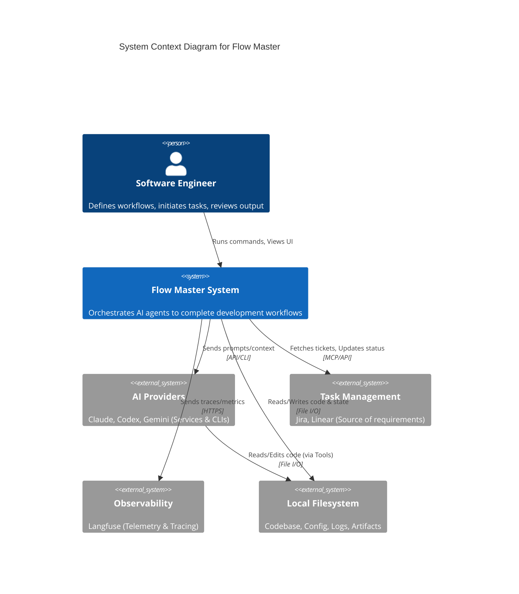

# Flow Master: AI-Powered Workflow Orchestration Platform

Flow Master is a local-first workflow orchestration platform designed for software engineers who need to automate complex, multi-phase development tasks that exceed the capabilities of single-shot AI tools. By combining the declarative structure of GitHub Actions with the adaptive intelligence of modern AI agents, Flow Master allows developers to define, execute, and monitor sophisticated workflows—such as full feature implementation, code reviews, and release pipelines—that require reasoning, context management, and tool execution. Unlike rigid scripts or chat-only interfaces, Flow Master maintains state, handles error recovery, and optimizes costs by routing tasks to the most appropriate AI provider.

---

## Executive Summary

**Business Context**
Software development teams currently face a "productivity paradox" with AI tools. While tools like Claude Code or Cursor accelerate individual coding tasks, complex features still require manual "orchestration overhead"—developers must break down specs, manage context between chat sessions, verify outputs, and manually chain steps together. Flow Master eliminates this overhead by automating the end-to-end workflow. This shifts the engineer's role from "doing the implementation" to "defining the vision," significantly increasing velocity for complex tasks and reducing context-switching fatigue.

**Technical Approach**
Flow Master employs a layered, service-oriented architecture built on Node.js. At its core is a deterministic **Workflow Orchestrator** powered by **XState v5**, which executes declarative YAML workflows. This engine coordinates an **Execution Layer** that abstracts various AI providers (Claude, Codex, Gemini) via a plugin system. Persistence is handled via a **File-First State Manager**, ensuring total transparency and crash recovery without requiring a database. The system uses an **Event-Driven** architecture to decouple execution from the User Interface, enabling both a headless CLI for CI/CD and a rich Electron-based GUI for interactive monitoring via WebSockets.

**Value Proposition**
By standardizing AI workflows, Flow Master delivers three key benefits: **Reliability**, through deterministic state machines that can resume after crashes; **Flexibility**, via a provider-agnostic design that prevents vendor lock-in and optimizes costs (e.g., using cheaper models for basic validation); and **Transparency**, as all artifacts, logs, and decisions are persisted as human-readable files. This enables teams to share "workflows as code," ensuring consistent quality standards across engineering organizations.

**Critical Constraints**
To ensure developer trust and ease of adoption, Flow Master adheres to strict constraints: it must run as a **single local process** (no Docker/Kubernetes required), maintain a **file-first philosophy** (no hidden databases), and support **offline/degraded modes** (caching Jira tasks locally). The architecture prioritizes **testability** and **modularity** to support a plugin ecosystem for future AI providers and tools.

---

## The Problem We're Solving

### Context and Environment

Modern software engineering involves complex, multi-step processes: reading specifications, planning architecture, implementing code across multiple files, writing tests, and generating pull requests. These activities occur in local development environments (IDEs, terminals) and integrate with external systems like Jira, GitHub, and Linear. Stakeholders include individual contributors, engineering managers seeking consistency, and DevOps teams managing pipelines.

### The Core Problem

Current AI coding assistants suffer from **"Context Rot"** and a lack of long-term planning. A developer cannot simply tell an AI agent, "Implement this epic from Jira," because the agent's context window fills up, it loses track of the original goal, or it hallucinates success without verifying files were created. Developers are forced into a manual loop: break down the task, prompt the AI, copy-paste errors, prompt again, and manually glue the steps together.

### Impact on Stakeholders

- **Developers**: Lose 30-40% of potential velocity gains to manual orchestration and context management.
- **Engineering Leads**: Struggle to enforce quality standards when AI generation is ad-hoc and opaque.
- **Organizations**: Face vendor lock-in to specific AI ecosystems (e.g., OpenAI vs. Anthropic) and cannot optimize costs based on task complexity.

### Why Current Solutions Fall Short

- **Scripting (Bash/Python)**: Deterministic but lacks intelligence to handle ambiguity or fix errors.
- **Chat Interfaces (ChatGPT/Claude Web)**: Intelligent but manual, non-reproducible, and isolated from the local filesystem/tools.
- **AI Editors (Cursor)**: Excellent for single-file edits but lack high-level workflow orchestration capabilities.

### Why This Matters

As AI models become commodities, the value shifts from the _model_ to the _workflow_. Solving orchestration is the key to unlocking the next order of magnitude in developer productivity—moving from "AI as a fancy autocomplete" to "AI as an autonomous junior engineer."

---

## Vision and Strategic Goals

### Vision Statement

Flow Master transforms software engineering by enabling developers to define their intent as high-level workflows, delegating the complex execution to coordinated, specialized AI agents while maintaining full transparency and control.

### Strategic Goals

- **SG-1**: Eliminate manual orchestration overhead by automating multi-phase development lifecycles (plan → implement → test → review).
- **SG-2**: Enable the reliable execution of complex tasks that exceed the context window of a single AI session.
- **SG-3**: Democratize AI-driven development by providing a vendor-agnostic platform that optimizes for cost and performance.

### Architectural Goals

- **AG-1**: Achieve **Deterministic Orchestration** of **Non-Deterministic Agents** using state machines to enforce process rigor.
- **AG-2**: Ensure **Crash Resilience** via atomic file-based persistence, allowing workflows to resume exactly where they left off.
- **AG-3**: Decouple **Execution** from **Presentation** to support seamless transition between headless CI/CD and interactive GUI modes.

### Capability Goals

- **CG-1**: Enable developers to switch AI providers (e.g., Claude for code, Gemini for review) per workflow phase via configuration.
- **CG-2**: Provide real-time, human-in-the-loop checkpoints for critical decisions (e.g., approving a deployment plan).
- **CG-3**: Allow teams to share and version-control development workflows as standard YAML files.

---

## How It Works: System Context

Flow Master operates as a local CLI tool that sits between the developer and various external services. The user provides a task (e.g., a Jira ID) and a workflow definition. Flow Master then acts as a conductor: it fetches context, spins up AI agents to perform work, executes tools (git, npm, etc.), validates results, and persists everything to the local disk.

Specifically, Flow Master reads a YAML workflow definition and converts it into an executable state machine. It manages the lifecycle of "Phases" (individual steps like Planning or Implementation). For each phase, it constructs a context, selects the appropriate AI provider, and executes the command. It captures all outputs, logs, and artifacts in real-time, streaming updates to the user via a CLI spinner or a rich Electron UI.

### System Context Diagram (C4 Level 1)



### System Context Description (AI-Readable)

**System**: Flow Master - A workflow orchestration platform for AI development tasks.

**Users and Actors**:

- **Software Engineer**: Interactive user who defines workflows, initiates runs, and approves checkpoints.

**External Systems**:

- **AI Providers**: External intelligence services (Claude, OpenAI, Google) used to execute non-deterministic tasks.
- **Task Management**: Systems of record (Jira, Linear) for fetching requirements and updating status.
- **Local Filesystem**: The hard drive where the project code, Flow Master configuration, and execution artifacts live.
- **Observability**: External platform (Langfuse) for tracking token usage, costs, and debugging traces.

**Information Flows**:

- Developer → Flow Master: Workflow commands (`flowmaster run`), Configuration.
- Flow Master → AI Providers: Prompts, Context (files, previous outputs).
- AI Providers → Flow Master: Generated code, Plans, Tool execution results.
- Flow Master → Filesystem: Persistent state (`state.json`), Logs, Artifacts.
- Flow Master → Task Management: Status updates, Comments.

---

## Architecture Overview

Flow Master utilizes a **Layered Architecture** combined with **Service-Oriented Design** principles. The system is decomposed into three distinct tiers with strict unidirectional dependencies (Tier 3 depends on Tier 2, Tier 2 on Tier 1). This ensures separation of concerns and high testability.

### Tier 1: Foundation Layer

**What it is**: The bedrock infrastructure components with zero internal dependencies.
**Why we use it**: To handle low-level concerns like event routing, state persistence, and validation rules independently of business logic.
**How it works**:

- **Event System**: A pure pub/sub bus handling communication between components.
- **State Manager**: Handles atomic file writes and reads for persistence.
- **Validation System**: Provides deterministic checks (file exists) and schema validation.
  **Benefits**: Enables crash recovery, consistent logging, and reliable I/O.

### Tier 2: Core Logic Layer

**What it is**: The "brain" and "hands" of the system.
**Why we use it**: To translate static YAML definitions into dynamic execution.
**How it works**:

- **Workflow Orchestrator**: Converts YAML to XState machines to manage execution flow, branching, and retries.
- **Execution Engine**: Prepares context, invokes AI providers, and processes their output.
  **Benefits**: Provides deterministic control over non-deterministic AI agents.

### Tier 3: Interface Layer

**What it is**: The user-facing controllers.
**Why we use it**: To present the system's state to the user in their preferred format.
**How it works**:

- **CLI Controller**: Renders spinners and text to stdout.
- **UI Controller**: Renders a React/Electron app via WebSockets.
  **Benefits**: Allows the core system to run "headless" or interactive without code changes.

---

## Technology Foundation

Flow Master is built on the **Node.js** runtime, chosen for its vast ecosystem, excellent I/O handling for file operations, and first-class support for AI SDKs.

### Orchestration Technology

**Technology Selected**: **XState v5**
**Rationale**: We require deterministic state transitions, visualizability, and the ability to serialize state (snapshots) for crash recovery. XState provides a formal finite state machine implementation that fits these needs perfectly.
**Alternatives Considered**: Custom imperative logic (too brittle), Temporal (too heavy/requires server).

### CLI Framework

**Technology Selected**: **oclif v4**
**Rationale**: The industry standard for Node.js CLIs. Provides robust argument parsing, plugin support, and TypeScript integration out of the box.
**Alternatives Considered**: Commander.js (less structured), Yargs (too simple).

### UI Architecture

**Technology Selected**: **Electron + React + WebSocket**
**Rationale**: Electron provides a native desktop experience. React manages the complex view state. WebSockets provide real-time, event-driven updates from the backend process to the UI renderer without polling.
**Alternatives Considered**: Ink (CLI-only UI, limited), Native Web App (requires cloud hosting).

---

## Key Design Decisions and Trade-Offs

### DD-1: File-Based Persistence Over Database

**Decision**: Flow Master stores all state (configuration, workflow definitions, execution logs, checkpoints) as human-readable files (JSON, YAML, Markdown) in an `.flowmaster/` directory.
**Rationale**: Maximizes transparency and portability. Developers can inspect state using standard tools (`cat`, `grep`, `git diff`).
**Benefits**:

- **Transparency**: Total visibility into system state.
- **Portability**: Zipping the folder moves the entire execution context.
- **Simplicity**: Zero dependency on external DB servers (Postgres, SQLite).
  **Costs**:
- **Query Speed**: Slower than SQL for complex queries (mitigated by optional in-memory SQLite cache for UI).
- **Concurrency**: Requires careful file locking strategies.

### DD-2: XState for Workflow Orchestration

**Decision**: Use formal Statecharts (XState) to model workflow execution instead of imperative code.
**Rationale**: Workflows involve complex states (waiting for approval, retrying, parallel execution). State machines make these explicit and testable.
**Benefits**:

- **Resumability**: Snapshots allow resuming workflows after crashes.
- **Visualization**: Workflows can be visualized as diagrams.
- **Safety**: Impossible states are made unrepresentable.
  **Costs**:
- **Learning Curve**: Higher barrier to entry for contributors unfamiliar with state machines.
- **Verbosity**: More boilerplate code than simple `async/await` loops.

### DD-3: Provider Abstraction Layer

**Decision**: Create a unified `IExecutionProvider` interface that abstracts both SDK-based (Claude) and Process-based (Codex CLI) AI tools.
**Rationale**: To prevent vendor lock-in and allow mixing different models within a single workflow.
**Benefits**:

- **Flexibility**: Swap backend models via config.
- **Future-Proofing**: Easy to add new providers (e.g., OpenCode).
- **Testing**: Easy to mock providers for integration tests.
  **Costs**:
- **Lowest Common Denominator**: Some unique features of specific providers might be harder to expose generically.

---

## Understanding the System Through Multiple Perspectives

### For Business Decision-Makers

**What You Need to Know**: Flow Master reduces the "tax" on using AI for development. It transforms sporadic, manual AI usage into consistent, automated business processes. It allows your organization to standardize how features are built and reviewed.
**Where to Go Next**:

- See [Business Context] for goals and ROI.

### For Technical Architects

**What You Need to Know**: Flow Master is a 3-tier Node.js application using XState for orchestration. It is local-first, file-based, and event-driven. It integrates with external tools via specific adapters (MCP for Jira, SDKs/CLI wrappers for AI).
**Where to Go Next**:

- See [Architecture Overview] for the tier breakdown.
- See [Data Model] for the schema definitions.

### For Developers

**What You Need to Know**: You define workflows in YAML. Flow Master handles the "glue" code. You can run it from your terminal or a desktop app. It keeps a log of everything in `.flowmaster/`.
**Where to Go Next**:

- See [CLI UX Design] for command usage.
- See [Workflow Orchestrator] to understand how to write workflows.

### For Operations Teams

**What You Need to Know**: Flow Master is a client-side tool distributed via npm or binary installers. It requires no server infrastructure. It emits OpenTelemetry traces that can be sent to observability platforms like Langfuse.
**Where to Go Next**:

- See [Logging & Telemetry] for monitoring configuration.

### For AI Agents

**What You Need to Know**: This project is structured as a monorepo. The core logic is in `core/`, CLI in `cli/`, and UI in `ui/`. Key definitions are in `design/flowmaster/design-notes/data-model.md`.
**Structured Metadata Available**:

- Data Models: `design/flowmaster/design-notes/data-model.md`
- Architecture: `design/flowmaster/design-notes/architecture-overview.md`
- Event Schema: `design/flowmaster/design-notes/event-system.md`

---

## Documentation Navigation Map

### Documentation Hierarchy

```
Flow Master Documentation/
├── 00-project-overview.md (This Document)
├── 01-business-context.md (Goals, Stakeholders)
├── 02-system-context.md (External Integrations)
├── 03-architectural-drivers.md (Requirements & Constraints)
├── 04-solution-strategy.md (High-level Design Choices)
│
├── Design Notes/ (Detailed Component Specs)
│   ├── architecture-overview.md (The Master Technical map)
│   ├── data-model.md (Schemas & Types)
│   ├── workflow-orchestrator.md (XState Logic)
│   ├── execution-engine.md (Command Processing)
│   ├── provider.md (AI Integrations)
│   ├── event-system.md (Pub/Sub & WebSockets)
│   ├── state-manager.md (Persistence)
│   ├── validation-agent.md (Quality Gates)
│   └── web-ui-architecture.md (Frontend)
```

### Documentation by Topic

**Understanding Workflow Logic**:

- Overview: [Architecture Overview]
- Logic: [Workflow Orchestrator]
- Persistence: [State Manager]

**Integrating AI Models**:

- Strategy: [Solution Strategy]
- Implementation: [Provider] & [Execution Engine]

**User Interface**:

- CLI: [CLI UX Design]
- Desktop/Web: [Web UI Architecture] & [Event System]

---

## Related Projects and Organizational Context

### Integration with Existing Systems

Flow Master integrates with **Jira** and **Linear** to fetch task context (descriptions, acceptance criteria) and update statuses. It utilizes the **Model Context Protocol (MCP)** to standardize these tool integrations.

### Dependencies

**External Dependencies**:

- **Anthropic API**: Primary intelligence provider.
- **Langfuse**: Telemetry and observability backend.
- **Jira/Atlassian**: Source of truth for task tracking.

---

## Success Metrics and Measurement

### Business Metrics

- **Orchestration Time Savings**: Reduction in time spent manually copying context between AI tools (Target: >70%).
- **Workflow Completion Rate**: Percentage of workflows that complete successfully without human intervention (Target: >90%).

### Technical Metrics

- **Crash Recovery**: 100% of crashed workflows can be resumed from the last successful phase.
- **Provider Switch Time**: Changing a workflow from Claude to Codex requires only YAML config changes (0 code changes).

---

## Next Steps and How to Get Started

### For Evaluators

1. Review the [Business Context] to understand the value prop.
2. Check [Architecture Overview] to see the technical feasibility.

### For Developers

1. `npm install` the repository.
2. Review `design/flowmaster/design-notes/data-model.md` to understand the core data structures.
3. Start with `design/flowmaster/design-notes/architecture-overview.md` to understand the component map.

---

## FAQ and Common Questions

### Q1: Why not just use a Python script?

**Answer**: Scripts are brittle. They don't handle state recovery, retries, context management, or provider switching gracefully. Flow Master provides the _infrastructure_ for reliability so you just write the logic.

### Q2: Does this replace Claude Code or Cursor?

**Answer**: No. Flow Master is an _orchestrator_. It uses Claude Code and Cursor as _execution engines_. It sits a layer above them to chain their operations together.

### Q3: Is my data sent to the cloud?

**Answer**: Flow Master itself is local-only. However, it sends prompts to the configured AI providers (Anthropic, OpenAI, etc.) and optional telemetry to Langfuse. Your local state stays on your disk.

---

## Glossary

**Workflow**: A multi-step process defined in YAML (e.g., "Feature Development").
**Phase**: A single step in a workflow (e.g., "Plan", "Implement").
**Command**: The specific instruction sent to an AI agent (defined in Markdown).
**Agent**: The AI entity (Claude, Codex) executing a command.
**Snapshot**: A serialized record of the XState machine at a specific point in time.
**Artifact**: A file generated during execution (code, diff, log, plan).
**Provider**: An adapter for a specific AI service (e.g., Claude Provider).

---

## Contact and Feedback

**Document Owner**: Flow Master Core Team
**Technical Questions**: Refer to the GitHub Issues or Architecture Review Board.
**Documentation Feedback**: Submit a PR to the `design/` directory.
